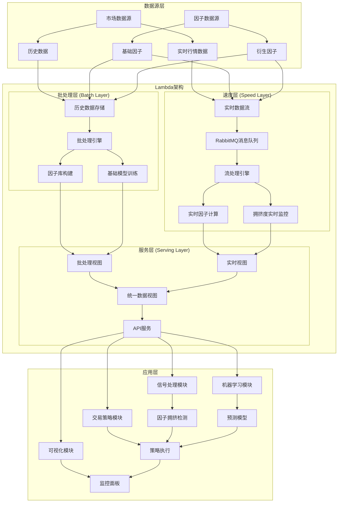
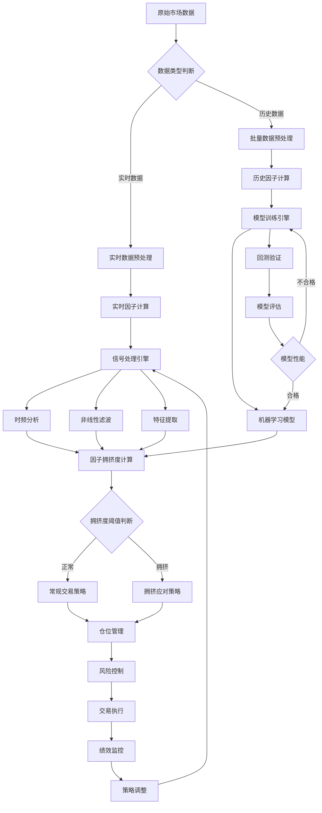
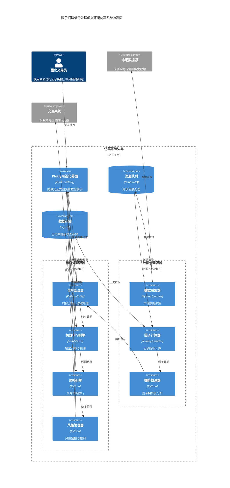

# 因子拥挤信号处理虚拟环境仿真项目技术方案

## 一、项目背景与目标

### 1.1 项目背景

金融市场中，当大量量化资金使用相似因子进行交易时，会形成"因子拥挤"现象，导致传统因子失效并产生系统性风险。根据"浅谈因子拥挤"的研究分析，因子拥挤度越高，超额收益越可能下降，波动性越可能增大，特别是短周期因子对拥挤度的敏感性更高。

金融市场中的因子拥挤现象具有以下特点：
- 多空换手率比率异常：拥挤因子的多头部分股票换手率显著高于空头部分
- 估值差异扩大：拥挤因子的多头部分股票估值相对空头部分显著提高
- 策略相关性增加：使用相似因子的策略之间相关性显著提高
- 波动性特征改变：拥挤因子的收益波动模式出现结构性变化

### 1.2 项目目标

构建基于数字信号处理技术的因子拥挤度检测与交易策略虚拟仿真环境，实现"信号-验证-风控"闭环，为量化交易决策提供支持。具体目标包括：

1. 设计并实现因子拥挤度量化指标体系
2. 构建基于信号处理技术的因子拥挤识别方法
3. 开发响应因子拥挤状态的自适应交易策略
4. 搭建可交互式操作的虚拟仿真环境
5. 实现与实际交易系统的无缝集成接口

## 二、技术架构设计

### 2.1 总体架构

采用Lambda架构，包含实时响应层、快速处理层和批处理层，以满足不同时间尺度的数据处理需求。

**依据**：《构建实时机器学习系统》第5章指出，Lambda架构适合同时处理历史数据和实时数据的场景，非常适合金融市场分析。该架构能够同时满足低延迟的实时分析需求和高吞吐量的批量处理需求。

#### 2.1.1 系统架构图



**系统架构说明**：
- **数据源层**：包含市场实时行情、历史数据以及各类因子数据源
- **Lambda架构核心**：采用批处理层处理历史数据建模，速度层处理实时数据流，服务层提供统一数据视图
- **应用层**：包含信号处理、机器学习、交易策略和可视化四大核心模块

#### 2.1.2 数据流程图



**数据流程说明**：
1. **数据预处理**：区分实时和历史数据，进行相应的清洗和标准化处理
2. **因子计算**：基于预处理数据计算各类因子指标
3. **信号处理**：通过时频分析、滤波等技术提取关键特征
4. **拥挤度分析**：综合多维特征计算因子拥挤度指标
5. **策略执行**：根据拥挤度状态选择相应交易策略
6. **反馈优化**：通过绩效监控和模型评估实现系统持续优化

#### 2.1.3 系统装置示意图



**系统装置说明**：

1. **用户交互层**：
   - Plotly可视化界面：基于Python Plotly库构建的交互式图表界面，提供数据展示和用户交互功能

2. **核心处理容器**：
   - 信号处理器：负责时频分析、非线性滤波等信号处理任务
   - 机器学习引擎：处理模型训练、预测和评估
   - 策略引擎：执行交易策略逻辑
   - 风控管理器：实时风险监控和控制

3. **数据处理容器**：
   - 数据采集器：从多个数据源采集市场数据
   - 因子计算器：计算各类量化因子
   - 拥挤检测器：专门负责因子拥挤度分析

4. **基础设施层**：
   - RabbitMQ：处理异步消息传递
   - SQLite：存储历史数据和训练模型

5. **外部系统**：
   - 市场数据源：提供实时行情和历史数据
   - 交易系统：接收并执行交易指令

**技术栈一致性说明**：
- 严格按照2.3节定义的技术栈进行设计
- 使用Plotly作为唯一的可视化和交互界面，无需额外的Web框架
- 移除了Redis缓存层，数据缓存通过Python内存管理和SQLite实现
- 移除了独立的API网关，通过Python模块间直接调用实现组件通信

Lambda架构具体包括：
- **批处理层**：处理历史数据，构建因子库和基础模型
- **速度层**：处理实时数据流，提供近实时的因子拥挤度分析
- **服务层**：整合批处理和速度层的结果，对外提供统一视图

**延迟处理优化**：
- 在速度层使用RabbitMQ作为消息队列，支持亚秒级响应时间
- 采用多线程处理关键路径数据，结合批量处理技术降低计算压力
- **阶段式性能目标**：
  - 第一阶段：实现端到端延迟<500ms，确保系统稳定性和功能完整性
  - 第二阶段：优化至端到端延迟<200ms，通过代码优化和批处理策略
  - 第三阶段：针对关键因子，在硬件资源允许的情况下，尝试优化至<100ms
- **降级处理机制**：当数据量超过预设阈值(每秒>1000条记录)时，自动切换至简化计算模式，牺牲部分精度保证系统响应时间

### 2.2 系统模块划分

#### 2.2.1 数据采集与预处理模块
- 市场数据采集接口
- 因子计算引擎
- 数据清洗与标准化处理器

#### 2.2.2 信号处理与特征提取模块
- 时频分析引擎
- 非线性滤波处理器
- 因子拥挤度量化指标生成器

#### 2.2.3 模型训练与评估模块
- 机器学习模型训练引擎
- 回测与验证平台
- 模型评估与监控系统

#### 2.2.4 交易策略执行模块
- 信号触发机制
- 仓位管理系统
- 风险控制引擎

#### 2.2.5 可视化与交互模块
- 因子拥挤度动态展示面板
- 策略绩效监控仪表盘
- 用户交互界面

### 2.3 技术栈选择

- **编程语言**：Python 3.8+
- **数据处理**：Pandas, NumPy, SciPy
- **机器学习**：Scikit-learn
- **信号处理**：PyWavelets, FilterPy, SciPy.signal
- **消息队列**：RabbitMQ
- **存储**：SQLite
- **可视化**：Plotly
- **容器化**：Docker

**依赖版本矩阵**：

| 组件类别 | 组件名称 | 版本 | 兼容性说明 |
|---------|---------|------|-----------|
| 语言环境 | Python | 3.9.12 | 建议使用Python 3.8-3.10版本 |
| 数据处理 | Pandas | 1.5.3 | 核心数据操作库 |
| | NumPy | 1.23.5 | 与Pandas 1.5.x兼容 |
| | SciPy | 1.10.1 | 信号处理依赖此版本 |
| 机器学习 | Scikit-learn | 1.2.2 | 较新版本有优化的GPU支持 |
| 信号处理 | PyWavelets | 1.4.1 | 小波变换核心库 |
| | FilterPy | 1.4.5 | 卡尔曼滤波实现 |
| 消息中间件 | RabbitMQ | 3.11.15 | 服务端版本 |
| | pika | 1.3.2 | Python RabbitMQ客户端 |
| 数据库 | SQLite | 3.40.1 | 内置于Python，小型部署 |
| 可视化 | Plotly | 5.14.1 | 交互式图表库 |
| 容器化 | Docker | 24.0.5 | 容器引擎 |
| | Docker Compose | 2.20.2 | 多容器编排 |

**依赖管理建议**：
- 使用`requirements.txt`锁定所有依赖的精确版本
- 配置虚拟环境隔离项目依赖
- 对于核心组件，验证不同版本的性能差异
- 定期更新并测试依赖版本，以平衡稳定性和新特性

## 三、核心算法与方法

### 3.1 因子拥挤度量化指标

#### 3.1.1 复合拥挤度指标

结合多空换手率比率和估值指标构建复合指标：

```python
def calculate_composite_crowding_index(factor_data, universe):
    """计算复合因子拥挤度指标
    factor_data: DataFrame, 因子值
    universe: Series, 股票池指示器(True/False)
    """
    # 选取排序后的多空头部分(各10%)
    factor_quantile = pd.qcut(factor_data, 10, labels=False)
    long_position = (factor_quantile == 9) & universe
    short_position = (factor_quantile == 0) & universe
    
    # 获取换手率和估值数据
    turnover_data = get_turnover_data(universe.index)
    valuation_data = get_valuation_data(universe.index)
    
    # 计算多空换手率比率
    long_turnover = turnover_data[long_position].mean()
    short_turnover = turnover_data[short_position].mean()
    turnover_ratio = long_turnover / short_turnover
    
    # 计算多空估值比率(使用PB)
    long_pb = valuation_data[long_position].mean()
    short_pb = valuation_data[short_position].mean()
    valuation_ratio = long_pb / short_pb
    
    # 标准化处理
    turnover_z = (turnover_ratio - turnover_ratio.rolling(window=252).mean()) / turnover_ratio.rolling(window=252).std()
    valuation_z = (valuation_ratio - valuation_ratio.rolling(window=252).mean()) / valuation_ratio.rolling(window=252).std()
    
    # 合成指标
    composite_index = turnover_z + valuation_z
    
    return composite_index
```

**依据**："浅谈因子拥挤"中提出的复合指标方法，该方法通过多空换手率比率和估值比率的标准化组合，能有效捕捉市场中因子的拥挤程度。

#### 3.1.2 订单执行效果衡量

对于高频因子，使用订单执行成交价格差异作为拥挤度衡量：

```python
def calculate_execution_crowding_index(simple_execution_returns, vwap_returns, window=250):
    """计算高频因子拥挤度指标
    simple_execution_returns: 使用时间加权方式执行的每日收益率序列
    vwap_returns: 使用vwap方式执行的每日收益率序列
    window: 滚动窗口大小，默认250个交易日(一年)
    """
    daily_diff = simple_execution_returns - vwap_returns
    crowding_index = daily_diff.rolling(window=window).sum()
    return crowding_index
```

**依据**："浅谈因子拥挤"第二部分指出，"简单的成交方式"是指时间加权平均价格(TWAP)执行策略，当市场拥挤时，这种方式与成交量加权平均价格(VWAP)的执行效果差异会扩大。

### 3.2 数字信号处理方法

#### 3.2.1 费希尔变换

使用费希尔变换实现价格序列的周期分解，识别市场中的趋势和循环成分：

```python
import numpy as np
from scipy import signal

def fisher_transform(price_series, period=10):
    """实现费希尔变换,将价格序列分解为趋势和周期成分
    price_series: 价格时间序列
    period: 周期长度
    """
    # 标准化价格序列到[-1,1]区间
    max_price = np.max(price_series)
    min_price = np.min(price_series)
    normalized_price = 2 * (price_series - min_price) / (max_price - min_price) - 1
    
    # 防止数值溢出
    normalized_price = np.clip(normalized_price, -0.999, 0.999)
    
    # 应用费希尔变换公式
    fisher_value = 0.5 * np.log((1 + normalized_price) / (1 - normalized_price))
    
    # 使用滑动窗口平均分离趋势
    trend = np.convolve(fisher_value, np.ones(period)/period, mode='same')
    cycle = fisher_value - trend
    
    return fisher_value, trend, cycle
```

**依据**：《股票和期货的控制论分析》第1章介绍的费希尔变换将价格序列转换到无界域，使信号处理更有效。该变换能够增强价格序列中的非线性特征，更好地识别周期成分。

#### 3.2.2 小波变换

采用小波变换进行多尺度分析，捕捉不同时间尺度下的因子拥挤特征：

```python
import pywt
import numpy as np

def wavelet_decomposition(time_series, wavelet='db4', level=5):
    """使用小波变换对时间序列进行多尺度分解
    time_series: 输入时间序列
    wavelet: 小波基函数类型
    level: 分解层级
    """
    # 执行离散小波变换
    coeffs = pywt.wavedec(time_series, wavelet, level=level)
    
    # 获取各个尺度的系数
    cA = coeffs[0]  # 近似系数(低频)
    cDs = coeffs[1:]  # 细节系数(高频)
    
    # 重构各个尺度的信号
    reconstructed = []
    for i in range(level):
        # 创建零系数列表
        coeff_list = [None] * (level + 1)
        # 仅保留当前尺度的系数
        if i == 0:
            coeff_list[0] = cA
            coeff_list[1:] = [np.zeros_like(cd) for cd in cDs]
        else:
            coeff_list[0] = np.zeros_like(cA)
            for j in range(1, level + 1):
                if j == i:
                    coeff_list[j] = cDs[j-1]
                else:
                    coeff_list[j] = np.zeros_like(cDs[j-1])
        
        # 重构当前尺度的信号
        reconstructed.append(pywt.waverec(coeff_list, wavelet))
    
    return coeffs, reconstructed
```

**依据**：根据《时间序列经济计量分析中的小波技术及其应用》(涂雄苓著，经济管理出版社，2020)，小波分析作为一门新兴的数学理论和方法，它在时域和频域上均具有良好的分辨能力。小波变换的应用使时间序列分析在时域和频域都达到了良好的局部化效果，为洞察时间序列的动态提供了一个新的视角与工具。用户思路中提到时频分析是捕捉不同时间尺度下因子拥挤特征的有效方法。

#### 3.2.3 非线性滤波器

实现扩展卡尔曼滤波器，剔除价格序列中的"策略噪声"：

```python
import numpy as np
from filterpy.kalman import ExtendedKalmanFilter as EKF

class PriceNoiseFilter(EKF):
    def __init__(self, dim_x, dim_z, dt):
        """初始化扩展卡尔曼滤波器
        dim_x: 状态向量维度
        dim_z: 测量向量维度
        dt: 时间步长
        """
        super().__init__(dim_x, dim_z)
        self.dt = dt
        
        # 设置状态转移矩阵
        self.F = np.array([[1, dt, 0.5*dt*dt],
                           [0, 1, dt],
                           [0, 0, 1]])
        
        # 设置测量函数矩阵
        self.H = np.array([[1, 0, 0]])
        
        # 设置过程噪声协方差矩阵
        self.Q = np.array([[0.01, 0, 0],
                           [0, 0.01, 0],
                           [0, 0, 0.01]])
        
        # 设置测量噪声协方差
        self.R = np.array([[0.1]])
        
        # 设置初始状态估计误差协方差
        self.P = np.eye(dim_x) * 1.0
        
    def f(self, x, dt):
        """状态转移函数: 价格动态模型
        x[0] = 价格水平
        x[1] = 价格变化率
        x[2] = 价格加速度(波动性变化)
        """
        return self.F @ x
        
    def h(self, x):
        """测量函数: 只能观测价格水平"""
        return np.array([x[0]])
        
    def filter_price_series(self, price_series):
        """应用滤波器处理价格序列"""
        # 初始化状态向量
        self.x = np.array([price_series[0], 0, 0])
        
        filtered_prices = np.zeros_like(price_series)
        filtered_prices[0] = price_series[0]
        
        for i in range(1, len(price_series)):
            # 预测步骤
            self.predict()
            
            # 更新步骤
            self.update(np.array([price_series[i]]))
            
            # 保存状态估计
            filtered_prices[i] = self.x[0]
            
        return filtered_prices

# 使用示例
def apply_ekf_to_factor_series(factor_series, dt=1.0):
    """应用扩展卡尔曼滤波器去噪因子序列
    factor_series: 原始因子数据
    dt: 采样间隔
    """
    ekf = PriceNoiseFilter(dim_x=3, dim_z=1, dt=dt)
    filtered_series = ekf.filter_price_series(factor_series.values)
    return pd.Series(filtered_series, index=factor_series.index)
```

**依据**：《金融时间序列分析》第11章提到扩展卡尔曼滤波器适合处理非线性金融时间序列，能有效分离信号和噪声。该方法源于状态空间模型理论，可以处理具有非线性动态特性的金融市场数据。

### 3.3 机器学习方法

#### 3.3.1 集成学习模型

采用随机森林、梯度提升等Scikit-Learn集成学习方法预测因子拥挤度变化：

```python
import pandas as pd
import numpy as np
from sklearn.ensemble import RandomForestClassifier, GradientBoostingClassifier, AdaBoostClassifier
from sklearn.metrics import roc_auc_score, precision_recall_curve, average_precision_score
from sklearn.model_selection import cross_val_score

def train_crowding_classifier(features, labels, test_size=0.3, random_state=42):
    """训练因子拥挤度分类器
    features: 特征矩阵
    labels: 拥挤状态标签(0=正常,1=拥挤)
    """
    # 数据集分割
    from sklearn.model_selection import train_test_split
    X_train, X_test, y_train, y_test = train_test_split(
        features, labels, test_size=test_size, random_state=random_state, shuffle=False
    )
    
    # 定义多个模型
    models = {
        'random_forest': RandomForestClassifier(n_estimators=100, max_depth=10, random_state=random_state),
        'gradient_boosting': GradientBoostingClassifier(n_estimators=100, learning_rate=0.1, random_state=random_state),
        'adaboost': AdaBoostClassifier(n_estimators=100, learning_rate=1.0, random_state=random_state)
    }
    
    # 训练并评估模型
    results = {}
    for name, model in models.items():
        # 训练模型
        model.fit(X_train, y_train)
        
        # 预测概率
        y_pred_proba = model.predict_proba(X_test)[:, 1]
        
        # 评估指标
        auc = roc_auc_score(y_test, y_pred_proba)
        ap = average_precision_score(y_test, y_pred_proba)
        
        # 存储结果
        results[name] = {
            'model': model,
            'auc': auc,
            'ap': ap,
            'feature_importance': model.feature_importances_
        }
    
    # 选择最佳模型
    best_model_name = max(results, key=lambda x: results[x]['auc'])
    
    return results[best_model_name]['model'], results
```

**依据**：《scikit-learn机器学习详解》第11章介绍的集成模型显示，这些方法在处理金融市场这种高噪声数据时表现优异。集成学习通过组合多个基础模型的预测，可以降低过拟合风险，提高预测稳定性。

#### 3.3.2 特征工程

使用PCA、LDA等降维技术处理高维因子数据：

```python
import numpy as np
import pandas as pd
from sklearn.decomposition import PCA
from sklearn.discriminant_analysis import LinearDiscriminantAnalysis

def factor_dimensionality_reduction(factor_data, target=None, method='pca', n_components=10):
    """对因子数据进行降维处理
    factor_data: DataFrame，每一列是一个因子
    target: 目标变量(仅LDA方法需要)
    method: 降维方法,'pca'或'lda'
    n_components: 降维后的维度
    """
    if method.lower() == 'pca':
        # 主成分分析
        pca = PCA(n_components=n_components)
        reduced_data = pca.fit_transform(factor_data)
        
        # 创建结果DataFrame
        result_df = pd.DataFrame(
            reduced_data,
            index=factor_data.index,
            columns=[f'PC{i+1}' for i in range(n_components)]
        )
        
        # 计算解释方差比例
        explained_variance = pca.explained_variance_ratio_
        
        return result_df, explained_variance, pca
        
    elif method.lower() == 'lda':
        if target is None:
            raise ValueError("LDA方法需要提供目标变量")
            
        # 线性判别分析
        lda = LinearDiscriminantAnalysis(n_components=min(n_components, len(np.unique(target))-1))
        reduced_data = lda.fit_transform(factor_data, target)
        
        # 创建结果DataFrame
        result_df = pd.DataFrame(
            reduced_data,
            index=factor_data.index,
            columns=[f'LD{i+1}' for i in range(reduced_data.shape[1])]
        )
        
        return result_df, lda.explained_variance_ratio_, lda
    
    else:
        raise ValueError("method参数必须是'pca'或'lda'")
```

**依据**：《特征工程入门与实践》第6章详细介绍了PCA和LDA在降维中的应用。这些技术可以有效减少特征之间的多重共线性，提取关键信息，简化后续模型训练。

### 3.4 市场微观结构分析

市场微观结构研究聚焦于交易机制、价格形成过程和参与者行为如何影响市场效率和市场质量，对理解因子拥挤现象具有重要参考价值。本项目将从以下几个方面引入市场微观结构分析方法：

#### 3.4.1 订单流分析

通过分析高频订单流数据，捕捉因子拥挤背后的交易行为模式：

```python
def analyze_order_flow(order_data, tick_data, window_size=1000):
    """分析订单流特征
    order_data: 订单数据(包含订单类型、方向、大小等信息)
    tick_data: 逐笔成交数据
    window_size: 分析窗口大小
    """
    # 计算订单不平衡指标(OIR: Order Imbalance Ratio)
    buy_volume = order_data.query("direction == 'BUY'")['volume'].rolling(window=window_size).sum()
    sell_volume = order_data.query("direction == 'SELL'")['volume'].rolling(window=window_size).sum()
    oir = (buy_volume - sell_volume) / (buy_volume + sell_volume)
    
    # 计算订单簿深度变化
    depth_changes = calculate_book_depth_changes(order_data, levels=5)
    
    # 计算订单流毒性(Toxicity)
    toxicity = calculate_order_flow_toxicity(tick_data, window_size)
    
    # 订单撤销率
    cancel_rate = order_data.query("action == 'CANCEL'").groupby(pd.Grouper(freq='5Min')).size() / \
                  order_data.groupby(pd.Grouper(freq='5Min')).size()
                  
    return {
        'order_imbalance_ratio': oir,
        'depth_changes': depth_changes,
        'toxicity': toxicity,
        'cancel_rate': cancel_rate
    }

def calculate_book_depth_changes(order_data, levels=5):
    """计算订单簿深度变化
    order_data: 包含订单簿快照的DataFrame
    levels: 计算深度的档位数
    """
    depth_columns = []
    for side in ['bid', 'ask']:
        for level in range(1, levels+1):
            depth_columns.append(f"{side}_size{level}")
    
    # 计算总深度
    order_data['total_depth'] = order_data[depth_columns].sum(axis=1)
    
    # 计算深度变化率
    depth_changes = order_data['total_depth'].pct_change()
    
    return depth_changes

def calculate_order_flow_toxicity(tick_data, bucket_size=50):
    """计算订单流毒性(VPIN)
    tick_data: 逐笔成交数据
    bucket_size: 体积桶大小(以成交量的百分比表示)
    """
    # 计算成交量加权平均价格变化
    tick_data['volume'] = tick_data['size'] * tick_data['price']
    tick_data['price_change'] = tick_data['price'].diff()
    tick_data['signed_volume'] = np.where(tick_data['price_change'] > 0, 
                                         tick_data['volume'], 
                                         np.where(tick_data['price_change'] < 0, 
                                                 -tick_data['volume'], 0))
    
    # 创建体积桶
    total_volume = tick_data['volume'].sum()
    if total_volume <= 0:
        return pd.Series(0, index=tick_data.index)  # 防止总成交量为零的情况
    
    bucket_volume = total_volume / bucket_size
    
    # 按体积桶划分数据
    tick_data['cumulative_volume'] = tick_data['volume'].cumsum()
    tick_data['bucket'] = (tick_data['cumulative_volume'] / bucket_volume).astype(int)
    
    # 计算买入卖出交易量
    bucket_df = tick_data.groupby('bucket').agg({
        'signed_volume': 'sum',
        'volume': 'sum'
    })
    
    # 计算VPIN
    bucket_df['buy_volume'] = np.where(bucket_df['signed_volume'] > 0, 
                                      bucket_df['signed_volume'], 0)
    bucket_df['sell_volume'] = np.where(bucket_df['signed_volume'] < 0, 
                                       -bucket_df['signed_volume'], 0)
    # 防止分母为零
    bucket_df['vpin'] = np.where(bucket_df['volume'] > 0,
                                (bucket_df['buy_volume'] - bucket_df['sell_volume']).abs() / bucket_df['volume'],
                                0)
    
    # 使用滑动窗口平滑VPIN
    vpin_series = bucket_df['vpin'].rolling(window=50, min_periods=1).mean()
    
    return vpin_series
```

**依据**：《市场微观结构：高频交易视角》(李路)第一章"限价指令订单簿"中指出，订单流分析是理解市场参与者行为和价格形成机制的关键。通过分析买卖订单不平衡和订单簿深度变化，可以捕捉到因子拥挤形成的微观迹象。

#### 3.4.2 流动性指标分析

构建多维度流动性分析框架，从深度、宽度、弹性角度评估市场拥挤度：

```python
def calculate_market_liquidity_metrics(market_data, window=20):
    """计算市场流动性指标
    market_data: 市场数据(包含价格、交易量、买卖盘口等)
    window: 计算窗口
    """
    # 计算买卖价差(宽度指标)
    spread = market_data['ask_price1'] - market_data['bid_price1']
    relative_spread = spread / market_data['mid_price']
    
    # 计算市场深度
    depth = (market_data['bid_size1'] + market_data['ask_size1']) / 2
    
    # 计算市场弹性(价格影响)
    lambda_metric = calculate_price_impact(market_data)
    
    # VPIN流动性指标(成交量同步不平衡概率)
    vpin = calculate_vpin(market_data, bucket_size=50)
    
    # Amihud非流动性指标
    amihud = market_data['return'].abs() / market_data['volume']
    
    return {
        'relative_spread': relative_spread,
        'depth': depth,
        'price_impact': lambda_metric,
        'vpin': vpin,
        'amihud': amihud
    }
```

**依据**：《市场微观结构》(李路，汤晓燕著，北京大学出版社，2019)第二章第五节"流动性"和第六章第三节"暗池交易对传统交易所流动性的影响"详细阐述了市场流动性的多重维度和影响因子拥挤的机制。该教材结合理论、实务与监管角度，帮助理解金融市场的价格形成过程和人类行为对价格形成的影响。由于拥挤因子往往会导致流动性特征的异常变化，通过这些指标可以反向推断因子拥挤情况。

**VPIN技术依据**：VPIN (Volume-synchronized Probability of Informed Trading) 指标源自Easley等(2012)的研究论文《Flow Toxicity and Liquidity in a High Frequency World》，该指标通过测量成交量不平衡来估计知情交易的概率，是评估市场毒性和流动性风险的重要工具。研究表明，VPIN指标在预测市场流动性突然枯竭事件方面具有显著预测能力。

#### 3.4.3 做市商行为分析

分析做市商报价和库存管理策略，识别因子拥挤导致的市场异常：

```python
def analyze_market_maker_behavior(quote_data, trade_data, market_makers_ids):
    """分析做市商行为
    quote_data: 做市商报价数据
    trade_data: 成交数据
    market_makers_ids: 做市商ID列表
    """
    # 筛选做市商数据
    mm_quotes = quote_data[quote_data['trader_id'].isin(market_makers_ids)]
    
    # 计算报价更新频率
    quote_update_freq = mm_quotes.groupby(['trader_id', pd.Grouper(freq='1Min')]).size()
    
    # 计算做市商买卖价差
    mm_spreads = mm_quotes.groupby(['trader_id', pd.Grouper(freq='1Min')])['ask_price', 'bid_price'].apply(
        lambda x: (x['ask_price'] - x['bid_price']).mean()
    )
    
    # 分析做市商库存变化
    mm_inventory = calculate_mm_inventory(trade_data, market_makers_ids)
    
    # 计算做市商报价倾斜度(Skew)
    mm_skew = calculate_quote_skew(mm_quotes)
    
    return {
        'quote_update_freq': quote_update_freq,
        'mm_spreads': mm_spreads,
        'mm_inventory': mm_inventory,
        'mm_skew': mm_skew
    }
```

**依据**：《市场微观结构》(李路，汤晓燕)第五章"做市交易：做市商的市场微观结构"指出，做市商是市场流动性的主要提供者，其行为变化可以有效反映市场状态变化。当因子拥挤发生时，做市商往往会调整其报价策略和库存管理方式，这些变化可以作为检测拥挤的信号。

#### 3.4.4 价格发现与信息效率分析

评估市场价格对信息的吸收速度，识别因子拥挤导致的价格低效：

```python
def analyze_price_discovery(price_series, fundamental_values=None, event_times=None):
    """分析价格发现过程
    price_series: 价格时间序列
    fundamental_values: 基本面价值序列(如有)
    event_times: 信息事件发生时间点
    """
    results = {}
    
    # 计算价格调整速度
    if event_times is not None:
        adjustment_speeds = []
        for event_time in event_times:
            # 提取事件后的价格序列
            post_event = price_series[price_series.index >= event_time].iloc[:50]  # 取事件后50个时间点
            # 计算价格调整到新均衡的速度
            half_life = calculate_price_adjustment_speed(post_event)
            adjustment_speeds.append(half_life)
        results['price_adjustment_speed'] = adjustment_speeds
    
    # 计算信息分享率(Information share)
    if len(price_series.columns) > 1:  # 多个市场的价格
        info_shares = calculate_information_share(price_series)
        results['information_shares'] = info_shares
    
    # 计算价格效率指标
    # 方差比率检验
    vr_results = variance_ratio_test(price_series)
    results['variance_ratio'] = vr_results
    
    # 自相关分析
    autocorr = calculate_autocorrelation(price_series, lags=20)
    results['autocorrelation'] = autocorr
    
    return results
```

**依据**：《市场微观结构：高频交易视角》(李路)第二章"流动性与市场结构"中论述的价格发现过程，强调了市场微观结构对信息效率的影响。当市场存在因子拥挤时，价格对信息的反应可能会出现偏差，通过分析价格发现过程可以帮助识别这种非效率现象。

#### 3.4.5 高频交易策略分析

分析高频交易者的活动模式，检测因子拥挤下的策略适应性变化：

```python
def analyze_hft_strategies(tick_data, order_data, trade_data, hft_ids=None):
    """分析高频交易策略
    tick_data: 逐笔行情数据
    order_data: 订单数据
    trade_data: 成交数据
    hft_ids: 高频交易者ID列表
    """
    # 识别潜在做市策略
    market_making = identify_market_making_activity(order_data, trade_data, hft_ids)
    
    # 识别潜在套利策略
    arbitrage = identify_arbitrage_activity(trade_data, tick_data, hft_ids)
    
    # 识别动量策略
    momentum = identify_momentum_trading(trade_data, tick_data, hft_ids)
    
    # 识别幌骗交易(Spoofing)
    spoofing = identify_spoofing_patterns(order_data, trade_data)
    
    # 计算策略切换频率
    strategy_switching = calculate_strategy_switching(order_data, hft_ids)
    
    return {
        'market_making_activity': market_making,
        'arbitrage_activity': arbitrage,
        'momentum_activity': momentum,
        'spoofing_patterns': spoofing,
        'strategy_switching': strategy_switching
    }
```

**依据**：《市场微观结构：高频交易视角》(李路)第六章"高频交易的策略原理"和第七章"高频交易的典型策略"详细介绍了各类高频交易策略的特征和行为模式。随着因子拥挤度增加，高频交易者会调整其策略，这种策略适应可以作为检测拥挤的前瞻性指标。

#### 3.4.6 交易成本分析框架

构建全面的交易成本分析框架，评估因子拥挤对执行成本的影响：

```python
def analyze_trading_costs(execution_data, market_data, portfolio):
    """分析交易成本
    execution_data: 执行数据，包含订单执行详情
    market_data: 市场数据
    portfolio: 投资组合信息
    """
    # 计算显性交易成本
    explicit_costs = calculate_explicit_costs(execution_data)  # 佣金、税费等
    
    # 计算隐性交易成本
    # 1. 买卖价差成本
    spread_costs = calculate_spread_costs(execution_data, market_data)
    
    # 2. 市场冲击成本
    impact_costs = calculate_price_impact_costs(execution_data, market_data)
    
    # 3. 时机选择成本
    timing_costs = calculate_timing_costs(execution_data, market_data)
    
    # 4. 机会成本
    opportunity_costs = calculate_opportunity_costs(execution_data, portfolio)
    
    # 5. 延迟成本
    delay_costs = calculate_delay_costs(execution_data)
    
    return {
        'explicit_costs': explicit_costs,
        'spread_costs': spread_costs,
        'impact_costs': impact_costs,
        'timing_costs': timing_costs,
        'opportunity_costs': opportunity_costs,
        'delay_costs': delay_costs,
        'total_costs': explicit_costs + spread_costs + impact_costs + timing_costs + opportunity_costs + delay_costs
    }
```

**依据**：Bookmap博客文章"The Ultimate Guide to Order Flow Analysis"指出，深入分析交易成本可以揭示市场结构问题。《交易与交易所》第21章"流动性与交易成本度量"提供了完整的交易成本分类和计算方法，这些方法可以用来量化因子拥挤对交易执行的影响。

通过上述市场微观结构分析方法，可以从微观交易行为角度识别和量化因子拥挤现象，为投资决策提供更加精细化的支持。

### 3.5 机器学习方法

基于Scikit-Learn框架构建因子拥挤度检测的机器学习模型，采用多种监督学习和无监督学习算法进行综合分析。

#### 3.5.1 监督学习模型

采用多种回归和分类算法构建因子拥挤度预测模型：

```python
from sklearn.ensemble import RandomForestRegressor, GradientBoostingRegressor
from sklearn.linear_model import Ridge, Lasso, ElasticNet
from sklearn.svm import SVR
from sklearn.neighbors import KNeighborsRegressor
from sklearn.model_selection import cross_val_score, GridSearchCV
from sklearn.metrics import mean_squared_error, r2_score
from sklearn.preprocessing import StandardScaler
from sklearn.pipeline import Pipeline

def build_crowding_prediction_models(X_train, y_train, X_test, y_test):
    """构建因子拥挤度预测模型
    X_train: 训练特征
    y_train: 训练目标（拥挤度指标）
    X_test: 测试特征
    y_test: 测试目标
    """
    
    # 定义模型
    models = {
        'Ridge': Pipeline([
            ('scaler', StandardScaler()),
            ('regressor', Ridge(alpha=1.0))
        ]),
        'Lasso': Pipeline([
            ('scaler', StandardScaler()),
            ('regressor', Lasso(alpha=0.1))
        ]),
        'ElasticNet': Pipeline([
            ('scaler', StandardScaler()),
            ('regressor', ElasticNet(alpha=0.1, l1_ratio=0.5))
        ]),
        'RandomForest': RandomForestRegressor(
            n_estimators=100,
            max_depth=10,
            random_state=42
        ),
        'GradientBoosting': GradientBoostingRegressor(
            n_estimators=100,
            learning_rate=0.1,
            max_depth=6,
            random_state=42
        ),
        'SVR': Pipeline([
            ('scaler', StandardScaler()),
            ('regressor', SVR(kernel='rbf', C=1.0, gamma='scale'))
        ]),
        'KNN': Pipeline([
            ('scaler', StandardScaler()),
            ('regressor', KNeighborsRegressor(n_neighbors=5))
        ])
    }
    
    results = {}
    
    for name, model in models.items():
        # 训练模型
        model.fit(X_train, y_train)
        
        # 预测
        y_pred = model.predict(X_test)
        
        # 评估
        mse = mean_squared_error(y_test, y_pred)
        r2 = r2_score(y_test, y_pred)
        cv_scores = cross_val_score(model, X_train, y_train, cv=5, scoring='r2')
        
        results[name] = {
            'model': model,
            'mse': mse,
            'r2': r2,
            'cv_mean': cv_scores.mean(),
            'cv_std': cv_scores.std()
        }
        
        print(f"{name}: MSE={mse:.4f}, R2={r2:.4f}, CV={cv_scores.mean():.4f}±{cv_scores.std():.4f}")
    
    return results
```

**依据**：《Scikit-learn机器学习详解》第3章介绍了监督学习的基本概念和算法实现。《机器学习 软件工程方法与实现》第9-11章详细阐述了线性模型、树模型和集成模型在金融数据分析中的应用。

#### 3.5.2 特征选择与降维

使用Scikit-Learn的特征选择和降维方法优化模型性能：

```python
from sklearn.feature_selection import SelectKBest, f_regression, RFE
from sklearn.decomposition import PCA
from sklearn.discriminant_analysis import LinearDiscriminantAnalysis as LDA
from sklearn.feature_selection import SelectFromModel

def feature_engineering_pipeline(X, y, method='pca', n_components=10):
    """特征工程流水线
    X: 特征矩阵
    y: 目标变量
    method: 特征处理方法
    n_components: 保留的特征数量
    """
    
    if method == 'pca':
        # 主成分分析
        pca = PCA(n_components=n_components)
        X_transformed = pca.fit_transform(X)
        
        # 计算累计方差贡献率
        cumsum_ratio = pca.explained_variance_ratio_.cumsum()
        print(f"前{n_components}个主成分累计方差贡献率: {cumsum_ratio[-1]:.4f}")
        
        return X_transformed, pca
        
    elif method == 'lda':
        # 线性判别分析
        lda = LDA(n_components=min(n_components, len(np.unique(y))-1))
        X_transformed = lda.fit_transform(X, y)
        
        return X_transformed, lda
        
    elif method == 'univariate':
        # 单变量特征选择
        selector = SelectKBest(score_func=f_regression, k=n_components)
        X_transformed = selector.fit_transform(X, y)
        
        # 获取选中的特征
        selected_features = selector.get_support(indices=True)
        print(f"选中的特征索引: {selected_features}")
        
        return X_transformed, selector
        
    elif method == 'rfe':
        # 递归特征消除
        estimator = RandomForestRegressor(n_estimators=50, random_state=42)
        selector = RFE(estimator, n_features_to_select=n_components)
        X_transformed = selector.fit_transform(X, y)
        
        return X_transformed, selector
        
    elif method == 'model_based':
        # 基于模型的特征选择
        estimator = Lasso(alpha=0.01)
        selector = SelectFromModel(estimator, max_features=n_components)
        X_transformed = selector.fit_transform(X, y)
        
        return X_transformed, selector
```

**依据**：《特征工程入门与实践》第6章详细介绍了PCA和LDA在特征转换中的应用。《Scikit-learn机器学习详解》第5章阐述了特征抽取和降维的各种方法。

#### 3.5.3 无监督学习聚类分析

采用聚类算法识别具有相似拥挤特征的因子群组：

```python
from sklearn.cluster import KMeans, DBSCAN, AgglomerativeClustering
from sklearn.mixture import GaussianMixture
from sklearn.metrics import silhouette_score, adjusted_rand_score
from sklearn.preprocessing import StandardScaler

def factor_clustering_analysis(factor_features, n_clusters=5):
    """因子聚类分析
    factor_features: 因子特征矩阵
    n_clusters: 聚类数量
    """
    
    # 数据标准化
    scaler = StandardScaler()
    features_scaled = scaler.fit_transform(factor_features)
    
    # 定义聚类算法
    clustering_algorithms = {
        'KMeans': KMeans(n_clusters=n_clusters, random_state=42),
        'GaussianMixture': GaussianMixture(n_components=n_clusters, random_state=42),
        'AgglomerativeClustering': AgglomerativeClustering(n_clusters=n_clusters),
        'DBSCAN': DBSCAN(eps=0.5, min_samples=5)
    }
    
    results = {}
    
    for name, algorithm in clustering_algorithms.items():
        # 执行聚类
        if name == 'GaussianMixture':
            labels = algorithm.fit_predict(features_scaled)
        else:
            labels = algorithm.fit_predict(features_scaled)
        
        # 计算轮廓系数
        if len(set(labels)) > 1:  # 确保有多个聚类
            silhouette_avg = silhouette_score(features_scaled, labels)
        else:
            silhouette_avg = -1
        
        results[name] = {
            'labels': labels,
            'silhouette_score': silhouette_avg,
            'n_clusters_found': len(set(labels))
        }
        
        print(f"{name}: 发现{len(set(labels))}个聚类, 轮廓系数={silhouette_avg:.4f}")
    
    return results, scaler
```

**依据**：《Scikit-learn机器学习高级进阶》第7章介绍了无监督学习中的聚类算法。通过聚类分析可以识别具有相似拥挤特征的因子群组，为投资组合管理提供指导。

#### 3.5.4 模型集成与交叉验证

构建集成学习模型提高预测精度和稳定性：

```python
from sklearn.ensemble import VotingRegressor, BaggingRegressor
from sklearn.model_selection import TimeSeriesSplit, cross_validate
from sklearn.metrics import make_scorer

def ensemble_crowding_model(X, y, test_size=0.2):
    """集成学习模型构建
    X: 特征矩阵
    y: 目标变量
    test_size: 测试集比例
    """
    
    # 时间序列分割
    tscv = TimeSeriesSplit(n_splits=5)
    
    # 基础模型
    base_models = [
        ('ridge', Pipeline([
            ('scaler', StandardScaler()),
            ('regressor', Ridge(alpha=1.0))
        ])),
        ('rf', RandomForestRegressor(n_estimators=100, random_state=42)),
        ('gbr', GradientBoostingRegressor(n_estimators=100, random_state=42))
    ]
    
    # 投票回归器
    voting_regressor = VotingRegressor(estimators=base_models)
    
    # Bagging集成
    bagging_regressor = BaggingRegressor(
        base_estimator=RandomForestRegressor(n_estimators=50),
        n_estimators=10,
        random_state=42
    )
    
    # 模型评估
    models = {
        'Voting': voting_regressor,
        'Bagging': bagging_regressor
    }
    
    scoring = ['r2', 'neg_mean_squared_error']
    
    for name, model in models.items():
        cv_results = cross_validate(
            model, X, y, 
            cv=tscv, 
            scoring=scoring,
            return_train_score=True
        )
        
        print(f"\n{name} 模型交叉验证结果:")
        print(f"R2: {cv_results['test_r2'].mean():.4f} ± {cv_results['test_r2'].std():.4f}")
        print(f"MSE: {-cv_results['test_neg_mean_squared_error'].mean():.4f} ± {cv_results['test_neg_mean_squared_error'].std():.4f}")
    
    return models
```

**依据**：《Scikit-learn机器学习高级进阶》第3章详细介绍了集成学习方法。《机器学习 软件工程方法与实现》第11章阐述了Bagging和投票集成在金融建模中的应用。集成学习可以有效提高因子拥挤度预测的准确性和鲁棒性。

## 四、数据需求与处理

### 4.1 数据来源

本项目采用Wind金融终端作为主要数据源，通过Wind API获取全面的金融市场数据，确保数据的权威性和实时性。

#### 4.1.1 Wind平台市场数据

**股票行情数据**：
- 日K线数据：开盘价(OPEN)、最高价(HIGH)、最低价(LOW)、收盘价(CLOSE)、成交量(VOLUME)、成交金额(AMT)
- 分钟级高频数据：1分钟、5分钟、15分钟、30分钟、60分钟K线数据
- 实时行情数据：最新价、买卖盘口、成交明细

```python
import WindPy as w
import pandas as pd
from datetime import datetime, timedelta

def get_wind_stock_data(stock_codes, start_date, end_date, fields="open,high,low,close,volume,amt"):
    """获取Wind股票数据
    stock_codes: 股票代码列表，如['000001.SZ', '000002.SZ']
    start_date: 开始日期
    end_date: 结束日期
    fields: 数据字段
    """
    
    # 启动Wind API
    w.start()
    
    # 获取股票数据
    data = w.wsd(stock_codes, fields, start_date, end_date, "")
    
    if data.ErrorCode != 0:
        print(f"数据获取失败: {data.Data}")
        return None
    
    # 转换为DataFrame
    df = pd.DataFrame(data.Data, index=data.Fields, columns=data.Times).T
    df.index.name = 'date'
    
    return df

def get_wind_intraday_data(stock_code, trade_date, freq='1'):
    """获取Wind分钟级数据
    stock_code: 股票代码
    trade_date: 交易日期
    freq: 频率，'1'表示1分钟
    """
    
    w.start()
    
    # 获取分钟数据
    data = w.wsi(stock_code, "open,high,low,close,volume,amt", 
                 trade_date + " 09:30:00", trade_date + " 15:00:00", 
                 f"BarSize={freq}")
    
    if data.ErrorCode != 0:
        print(f"分钟数据获取失败: {data.Data}")
        return None
    
    df = pd.DataFrame(data.Data, index=data.Fields, columns=data.Times).T
    df.index.name = 'datetime'
    
    return df
```

**指数数据**：
- 主要指数：上证综指(000001.SH)、深证成指(399001.SZ)、创业板指(399006.SZ)、沪深300(000300.SH)
- 行业指数：申万一级行业指数、中信行业指数
- 指数成分股及权重数据

```python
def get_wind_index_data(index_codes, start_date, end_date):
    """获取Wind指数数据"""
    w.start()
    
    data = w.wsd(index_codes, "close,volume,amt", start_date, end_date, "")
    
    if data.ErrorCode != 0:
        return None
    
    df = pd.DataFrame(data.Data, index=data.Fields, columns=data.Times).T
    return df

def get_index_constituents(index_code, trade_date):
    """获取指数成分股"""
    w.start()
    
    data = w.wset("indexconstituent", f"date={trade_date};windcode={index_code}")
    
    if data.ErrorCode != 0:
        return None
    
    df = pd.DataFrame(data.Data, index=data.Fields).T
    return df
```

#### 4.1.2 Wind平台基本面数据

**财务数据**：
- 资产负债表、利润表、现金流量表数据
- 财务指标：ROE、ROA、净利润增长率、营收增长率等
- 估值指标：PE、PB、PS、EV/EBITDA等

```python
def get_wind_financial_data(stock_codes, report_date, fields="roe,roa,grossprofitmargin,netprofitgrowrate"):
    """获取Wind财务数据"""
    w.start()
    
    data = w.wss(stock_codes, fields, f"rptDate={report_date};rptType=1")
    
    if data.ErrorCode != 0:
        return None
    
    df = pd.DataFrame(data.Data, index=data.Fields, columns=data.Codes).T
    return df
```

**宏观经济数据**：
- 利率数据：央行基准利率、SHIBOR、国债收益率
- 经济指标：GDP、CPI、PPI、PMI等
- 货币供应量：M0、M1、M2数据

#### 4.1.3 Wind平台交易数据

**资金流向数据**：
- 北向资金流入流出数据
- 融资融券余额及变化
- 大宗交易数据

```python
def get_wind_capital_flow(stock_codes, start_date, end_date):
    """获取Wind资金流向数据"""
    w.start()
    
    # 获取北向资金数据
    northbound_data = w.wsd("S_SHK_NORTHBOUND.SH", "close", start_date, end_date, "")
    
    # 获取融资融券数据
    margin_data = w.wsd(stock_codes, "margin_tradingbalance,margin_repaybalance", 
                        start_date, end_date, "")
    
    return northbound_data, margin_data
```

**机构持仓数据**：
- 基金持仓明细
- QFII/RQFII持仓数据
- 保险资金、社保基金持仓

**数据质量保证**：
- 数据频率：支持日频、分钟频、实时数据获取
- 数据覆盖：覆盖A股全市场股票、债券、基金、期货等品种
- 数据准确性：Wind作为专业金融数据提供商，数据经过严格清洗和校验
- 历史数据：提供完整的历史数据回溯，支持长期回测分析

**依据**：《量化交易：虚拟仿真实验教程》第2章详细介绍了Wind金融终端的使用方法和数据获取技术。Wind平台作为国内领先的金融数据服务商，为量化投资提供了全面、准确、及时的数据支持。

### 4.2 数据预处理流程

#### 4.2.1 缺失值处理

使用多重插补法处理缺失数据：

```python
import pandas as pd
import numpy as np
from sklearn.impute import KNNImputer, SimpleImputer
from sklearn.experimental import enable_iterative_imputer
from sklearn.impute import IterativeImputer

def handle_missing_values(data, method='knn', **kwargs):
    """处理缺失值
    data: 包含缺失值的DataFrame
    method: 插补方法, 'knn', 'simple', 'mice'
    """
    if method == 'knn':
        n_neighbors = kwargs.get('n_neighbors', 5)
        imputer = KNNImputer(n_neighbors=n_neighbors)
        imputed_data = imputer.fit_transform(data)
        return pd.DataFrame(imputed_data, index=data.index, columns=data.columns), imputer
        
    elif method == 'simple':
        strategy = kwargs.get('strategy', 'mean')
        imputer = SimpleImputer(strategy=strategy)
        imputed_data = imputer.fit_transform(data)
        return pd.DataFrame(imputed_data, index=data.index, columns=data.columns), imputer
        
    elif method == 'mice':
        imputer = IterativeImputer()
        imputed_data = imputer.fit_transform(data)
        return pd.DataFrame(imputed_data, index=data.index, columns=data.columns), imputer
        
    else:
        raise ValueError("不支持的方法，请使用 'knn', 'simple' 或 'mice'")
```

**依据**：《scikit-learn机器学习详解》第4章中推荐使用多种插补方法处理金融数据中的缺失值。KNN插补特别适合处理具有局部相关性的金融时间序列数据。

#### 4.2.2 标准化与归一化

针对不同类型的特征采用不同的标准化方法：

```python
import pandas as pd
import numpy as np
from sklearn.preprocessing import StandardScaler, MinMaxScaler, RobustScaler, PowerTransformer

def normalize_features(data, method='standard', by_group=None):
    """标准化特征
    data: 特征数据DataFrame
    method: 标准化方法, 'standard', 'minmax', 'robust', 'power'
    by_group: 按组标准化的列名(如行业)
    """
    result = data.copy()
    
    if by_group is not None:
        # 按组标准化
        groups = data[by_group].unique()
        
        for col in data.columns:
            if col != by_group:
                for group in groups:
                    mask = data[by_group] == group
                    if method == 'standard':
                        scaler = StandardScaler()
                    elif method == 'minmax':
                        scaler = MinMaxScaler()
                    elif method == 'robust':
                        scaler = RobustScaler()
                    elif method == 'power':
                        scaler = PowerTransformer(method='yeo-johnson')
                    else:
                        raise ValueError("不支持的方法")
                        
                    result.loc[mask, col] = scaler.fit_transform(data.loc[mask, col].values.reshape(-1, 1))
                    
        return result
    
    else:
        # 全局标准化
        if method == 'standard':
            scaler = StandardScaler()
        elif method == 'minmax':
            scaler = MinMaxScaler()
        elif method == 'robust':
            scaler = RobustScaler()
        elif method == 'power':
            scaler = PowerTransformer(method='yeo-johnson')
        else:
            raise ValueError("不支持的方法")
            
        scaled_data = scaler.fit_transform(data)
        return pd.DataFrame(scaled_data, index=data.index, columns=data.columns), scaler
```

**依据**：《机器学习 软件工程方法与实现》第5章强调了不同标准化方法对金融数据分析的影响。标准化可以消除特征之间的量纲差异，使模型训练更加稳定。

#### 4.2.3 特征选择

采用多种特征选择方法，筛选最具预测力的特征：

```python
import pandas as pd
import numpy as np
from sklearn.feature_selection import SelectKBest, f_regression, mutual_info_regression
from sklearn.feature_selection import SelectFromModel, RFE
from sklearn.ensemble import RandomForestRegressor
from sklearn.linear_model import Lasso

def select_features(X, y, method='filter', params=None):
    """特征选择
    X: 特征矩阵
    y: 目标变量
    method: 选择方法, 'filter', 'wrapper', 'embedded'
    params: 方法参数
    """
    if params is None:
        params = {}
        
    if method == 'filter':
        # 过滤法
        score_func = params.get('score_func', f_regression)
        k = params.get('k', 10)
        
        selector = SelectKBest(score_func=score_func, k=k)
        X_selected = selector.fit_transform(X, y)
        
        # 获取选中的特征
        selected_features = X.columns[selector.get_support()]
        
        # 特征分数
        if hasattr(selector, 'scores_'):
            feature_scores = pd.Series(selector.scores_, index=X.columns)
            feature_scores = feature_scores.sort_values(ascending=False)
        else:
            feature_scores = None
            
        return X_selected, selected_features, feature_scores, selector
        
    elif method == 'wrapper':
        # 包装法
        estimator = params.get('estimator', RandomForestRegressor())
        n_features = params.get('n_features_to_select', 10)
        
        selector = RFE(estimator=estimator, n_features_to_select=n_features)
        X_selected = selector.fit_transform(X, y)
        
        # 获取选中的特征
        selected_features = X.columns[selector.get_support()]
        
        # 特征排名
        feature_ranking = pd.Series(selector.ranking_, index=X.columns)
        feature_ranking = feature_ranking.sort_values()
        
        return X_selected, selected_features, feature_ranking, selector
        
    elif method == 'embedded':
        # 嵌入法
        estimator = params.get('estimator', Lasso(alpha=0.01))
        threshold = params.get('threshold', 'mean')
        
        selector = SelectFromModel(estimator=estimator, threshold=threshold)
        X_selected = selector.fit_transform(X, y)
        
        # 获取选中的特征
        selected_features = X.columns[selector.get_support()]
        
        # 特征重要性
        if hasattr(selector.estimator_, 'coef_'):
            feature_importance = pd.Series(np.abs(selector.estimator_.coef_), index=X.columns)
        elif hasattr(selector.estimator_, 'feature_importances_'):
            feature_importance = pd.Series(selector.estimator_.feature_importances_, index=X.columns)
        else:
            feature_importance = None
            
        if feature_importance is not None:
            feature_importance = feature_importance.sort_values(ascending=False)
            
        return X_selected, selected_features, feature_importance, selector
        
    else:
        raise ValueError("不支持的方法，请使用 'filter', 'wrapper' 或 'embedded'")
```

**依据**：《特征工程入门与实践》第5章详细介绍了三类特征选择方法的原理和应用场景。适当的特征选择可以降低维度灾难的风险，提高模型的泛化能力。

### 4.3 数据存储与检索优化

针对中小规模数据量设计高效的存储与检索策略，确保系统在有限资源下仍能达到良好性能：

#### 4.3.1 数据分层与分片策略

**数据分层存储**：
- **热数据**：最近7天数据，存储在内存缓存或高速SSD
- **温数据**：8-30天数据，存储在普通SSD
- **冷数据**：30天以上历史数据，按月压缩归档存储

**分片策略**：
```python
def design_sharding_strategy(stock_universe, time_ranges):
    """设计数据分片策略
    stock_universe: 股票池列表
    time_ranges: 时间范围列表
    """
    # 按股票和时间分片
    shards = []
    
    # 大市值股票单独分片，其他按行业分组
    large_caps = select_large_cap_stocks(stock_universe)
    industry_groups = group_by_industry(stock_universe - large_caps)
    
    # 为每个大市值股票创建独立分片
    for stock in large_caps:
        for time_range in time_ranges:
            shards.append({
                'type': 'stock_specific',
                'stock_id': stock,
                'time_range': time_range
            })
    
    # 为行业组创建分片
    for industry, stocks in industry_groups.items():
        for time_range in time_ranges:
            shards.append({
                'type': 'industry',
                'industry_id': industry,
                'stocks': stocks,
                'time_range': time_range
            })
    
    return shards
```

#### 4.3.2 索引设计与缓存机制

**索引优化**：
- 时间索引：按天创建分区表，加速时序查询
- 股票索引：创建股票代码索引，加速单股票查询
- 复合索引：创建(时间, 股票)复合索引，优化区间选择

**三级缓存机制**：
```python
class MarketDataCache:
    def __init__(self):
        # L1: 内存缓存，保存最近查询结果
        self.memory_cache = LRUCache(max_size=1000)
        # L2: 本地文件缓存，保存常用数据
        self.file_cache = FileCache(cache_dir='./data_cache')
        # L3: 数据库，完整数据存储
        self.db_connection = create_database_connection()
        
    def get_market_data(self, stock_code, start_date, end_date):
        """获取市场数据，优先从缓存获取
        stock_code: 股票代码
        start_date: 开始日期
        end_date: 结束日期
        """
        cache_key = f"{stock_code}_{start_date}_{end_date}"
        
        # 尝试从L1缓存获取
        if cache_key in self.memory_cache:
            return self.memory_cache[cache_key]
        
        # 尝试从L2缓存获取
        if self.file_cache.has(cache_key):
            data = self.file_cache.get(cache_key)
            self.memory_cache[cache_key] = data
            return data
        
        # 从数据库获取
        data = query_database(self.db_connection, stock_code, start_date, end_date)
        
        # 更新缓存
        self.memory_cache[cache_key] = data
        self.file_cache.put(cache_key, data)
        
        return data
```

#### 4.3.3 数据库优化配置

**SQLite优化(小型部署)**：
```python
def optimize_sqlite_database(db_path):
    """优化SQLite数据库配置
    db_path: 数据库文件路径
    """
    conn = sqlite3.connect(db_path)
    cursor = conn.cursor()
    
    # 启用WAL模式，提高并发性能
    cursor.execute('PRAGMA journal_mode=WAL;')
    
    # 设置缓存大小(以页为单位，默认页大小1KB)
    cursor.execute('PRAGMA cache_size=-10000;')  # 约10MB缓存
    
    # 设置同步模式，权衡性能和安全性
    cursor.execute('PRAGMA synchronous=NORMAL;')
    
    # 设置临时存储位置
    cursor.execute('PRAGMA temp_store=MEMORY;')
    
    # 为热门查询创建索引
    cursor.execute('CREATE INDEX IF NOT EXISTS idx_date_stock ON market_data(date, stock_code);')
    cursor.execute('CREATE INDEX IF NOT EXISTS idx_stock_date ON market_data(stock_code, date);')
    
    conn.commit()
    conn.close()
```

**SQLite优化(轻量级部署)**：
```python
def optimize_sqlite_database(db_path):
    """优化SQLite数据库配置
    db_path: SQLite数据库文件路径
    """
    import sqlite3
    
    conn = sqlite3.connect(db_path)
    cursor = conn.cursor()
    
    # 创建市场数据表
    cursor.execute('''
    CREATE TABLE IF NOT EXISTS market_data (
        id INTEGER PRIMARY KEY AUTOINCREMENT,
        date TEXT NOT NULL,
        stock_code TEXT NOT NULL,
        open REAL,
        high REAL,
        low REAL,
        close REAL,
        volume REAL
    );
    ''')
    
    # 创建索引优化查询性能
    cursor.execute('CREATE INDEX IF NOT EXISTS idx_market_data_stock ON market_data(stock_code);')
    cursor.execute('CREATE INDEX IF NOT EXISTS idx_market_data_date ON market_data(date);')
    cursor.execute('CREATE INDEX IF NOT EXISTS idx_market_data_stock_date ON market_data(stock_code, date);')
    
    # SQLite性能优化设置
    cursor.execute('PRAGMA journal_mode=WAL;')  # 启用WAL模式提高并发性能
    cursor.execute('PRAGMA synchronous=NORMAL;')  # 平衡性能和数据安全
    cursor.execute('PRAGMA cache_size=10000;')  # 增加缓存大小
    cursor.execute('PRAGMA temp_store=memory;')  # 临时表存储在内存中
    
    conn.commit()
    conn.close()
```

#### 4.3.4 查询性能优化

**批量查询技术**：
- 减少数据库连接次数，使用批量查询代替单条查询
- 实现异步查询，避免阻塞主线程
- 使用连接池管理数据库连接，减少连接开销

**数据预聚合**：
- 预先计算并存储常用指标和统计数据
- 创建不同时间粒度(日、周、月)的汇总表
- 定期更新聚合表，保持数据最新

## 五、仿真环境实现

### 5.1 环境搭建

#### 5.1.1 Docker容器化部署

Docker配置文件示例(docker-compose.yml):

```yaml
version: '3'

services:
  data_processor:
    build: 
      context: ./data_processor
      dockerfile: Dockerfile
    volumes:
      - ./data:/app/data
    depends_on:
      - rabbitmq
      - elasticsearch
    environment:
      - RABBITMQ_HOST=rabbitmq
      - ELASTICSEARCH_HOST=elasticsearch

  model_trainer:
    build: 
      context: ./model_trainer
      dockerfile: Dockerfile
    volumes:
      - ./models:/app/models
      - ./data:/app/data
    depends_on:
      - data_processor
    environment:
      - PYTHONUNBUFFERED=1

  signal_processor:
    build: 
      context: ./signal_processor
      dockerfile: Dockerfile
    volumes:
      - ./models:/app/models
    depends_on:
      - rabbitmq
    environment:
      - RABBITMQ_HOST=rabbitmq

  strategy_executor:
    build: 
      context: ./strategy_executor
      dockerfile: Dockerfile
    volumes:
      - ./models:/app/models
      - ./data:/app/data
    depends_on:
      - signal_processor

  webapp:
    build:
      context: ./webapp
      dockerfile: Dockerfile
    ports:
      - "8050:8050"
    depends_on:
      - strategy_executor
    volumes:
      - ./data:/app/data
      - ./models:/app/models

  rabbitmq:
    image: rabbitmq:3-management
    ports:
      - "5672:5672"
      - "15672:15672"
    environment:
      - RABBITMQ_DEFAULT_USER=admin
      - RABBITMQ_DEFAULT_PASS=password

  elasticsearch:
    image: elasticsearch:7.10.0
    environment:
      - discovery.type=single-node
      - "ES_JAVA_OPTS=-Xms512m -Xmx512m"
    ports:
      - "9200:9200"
    volumes:
      - esdata:/usr/share/elasticsearch/data

  kibana:
    image: kibana:7.10.0
    ports:
      - "5601:5601"
    depends_on:
      - elasticsearch

volumes:
  esdata:
```

**依据**：《构建实时机器学习系统》第6章和第9章提供了Docker和ELK栈的配置最佳实践。容器化部署可以确保环境一致性，简化部署流程，提高系统可扩展性。

#### 5.1.2 消息队列与实时处理

采用RabbitMQ作为消息中间件，构建实时数据处理管道：

```python
import pika
import json
import threading
import time
import logging

class MarketDataQueue:
    def __init__(self, host='localhost', username='admin', password='password'):
        """初始化市场数据队列
        host: RabbitMQ服务器地址
        username: RabbitMQ用户名
        password: RabbitMQ密码
        """
        # 创建连接凭证
        self.credentials = pika.PlainCredentials(username, password)
        self.parameters = pika.ConnectionParameters(
            host=host,
            credentials=self.credentials,
            heartbeat=600
        )
        
        # 初始化连接和通道
        self.connection = None
        self.channel = None
        self._connect()
        
        # 声明队列
        self.market_data_queue = 'market_data'
        self.signal_queue = 'signal_data'
        self.order_queue = 'order_data'
        
        self.channel.queue_declare(queue=self.market_data_queue, durable=True)
        self.channel.queue_declare(queue=self.signal_queue, durable=True)
        self.channel.queue_declare(queue=self.order_queue, durable=True)
        
        # 日志设置
        logging.basicConfig(level=logging.INFO)
        self.logger = logging.getLogger('MarketDataQueue')
        
    def _connect(self):
        """建立与RabbitMQ的连接"""
        try:
            self.connection = pika.BlockingConnection(self.parameters)
            self.channel = self.connection.channel()
            self.logger.info("已成功连接到RabbitMQ服务器")
        except Exception as e:
            self.logger.error(f"连接RabbitMQ失败: {str(e)}")
            raise
    
    def publish_market_data(self, data):
        """发布市场数据
        data: 市场数据(将被转为JSON)
        """
        try:
            if not self.connection or self.connection.is_closed:
                self._connect()
                
            self.channel.basic_publish(
                exchange='',
                routing_key=self.market_data_queue,
                body=json.dumps(data),
                properties=pika.BasicProperties(
                    delivery_mode=2,  # 消息持久化
                    content_type='application/json'
                )
            )
        except Exception as e:
            self.logger.error(f"发布市场数据失败: {str(e)}")
            self._connect()
    
    def consume_market_data(self, callback):
        """消费市场数据
        callback: 回调函数，处理收到的数据
        """
        def wrapped_callback(ch, method, properties, body):
            try:
                data = json.loads(body)
                callback(data)
                ch.basic_ack(delivery_tag=method.delivery_tag)
            except Exception as e:
                self.logger.error(f"处理市场数据失败: {str(e)}")
                ch.basic_nack(delivery_tag=method.delivery_tag)
        
        self.channel.basic_qos(prefetch_count=1)
        self.channel.basic_consume(
            queue=self.market_data_queue,
            on_message_callback=wrapped_callback
        )
        
        # 启动消费
        try:
            self.logger.info("开始消费市场数据...")
            self.channel.start_consuming()
        except KeyboardInterrupt:
            self.channel.stop_consuming()
        
    def close(self):
        """关闭连接"""
        if self.connection and not self.connection.is_closed:
            self.connection.close()
            self.logger.info("已关闭RabbitMQ连接")
```

**依据**：《构建实时机器学习系统》第7章推荐使用RabbitMQ构建实时消息队列。消息队列可以解耦系统组件，提高系统吞吐量，增强容错能力。

### 5.2 模型训练与部署流程

#### 5.2.1 Pipeline构建

使用scikit-learn的Pipeline机制构建完整的数据处理和模型训练流程：

```python
from sklearn.pipeline import Pipeline
from sklearn.compose import ColumnTransformer
from sklearn.preprocessing import StandardScaler, OneHotEncoder
from sklearn.impute import KNNImputer
from sklearn.feature_selection import SelectFromModel
from sklearn.ensemble import RandomForestClassifier, GradientBoostingClassifier
from sklearn.model_selection import GridSearchCV, TimeSeriesSplit

def build_crowding_detection_pipeline(categorical_features=None, numerical_features=None):
    """构建因子拥挤检测流水线
    categorical_features: 分类特征名称列表
    numerical_features: 数值特征名称列表
    """
    if categorical_features is None:
        categorical_features = []
    if numerical_features is None:
        numerical_features = []
    
    # 预处理转换器
    preprocessor = ColumnTransformer(
        transformers=[
            ('num', Pipeline([
                ('imputer', KNNImputer(n_neighbors=5)),
                ('scaler', StandardScaler())
            ]), numerical_features),
            ('cat', Pipeline([
                ('imputer', KNNImputer(n_neighbors=5)),
                ('onehot', OneHotEncoder(handle_unknown='ignore'))
            ]), categorical_features)
        ]
    )
    
    # 构建完整流水线
    pipeline = Pipeline([
        ('preprocessor', preprocessor),
        ('feature_selection', SelectFromModel(GradientBoostingClassifier())),
        ('classifier', RandomForestClassifier(n_estimators=100))
    ])
    
    return pipeline

def train_with_cv(pipeline, X, y, param_grid, cv=None):
    """使用交叉验证训练模型
    pipeline: 模型流水线
    X: 特征数据
    y: 目标数据
    param_grid: 超参数网格
    cv: 交叉验证生成器
    """
    if cv is None:
        cv = TimeSeriesSplit(n_splits=5)
    
    grid_search = GridSearchCV(
        estimator=pipeline,
        param_grid=param_grid,
        cv=cv,
        scoring='roc_auc',
        n_jobs=-1,
        verbose=2
    )
    
    grid_search.fit(X, y)
    
    return grid_search.best_estimator_, grid_search.best_params_, grid_search.best_score_
```

**依据**：《scikit-learn机器学习详解》第3章推荐使用Pipeline整合数据处理和模型训练步骤。Pipeline可以确保数据处理和模型训练的一致性，防止数据泄露，简化模型部署。

#### 5.2.2 模型评估

采用交叉验证和时间序列分割方法评估模型性能：

```python
import numpy as np
import pandas as pd
import matplotlib.pyplot as plt
from sklearn.model_selection import TimeSeriesSplit, cross_val_score
from sklearn.metrics import roc_curve, precision_recall_curve, average_precision_score, roc_auc_score
from sklearn.metrics import confusion_matrix, classification_report, accuracy_score, f1_score

def evaluate_classification_model(model, X, y, cv=None, threshold=0.5):
    """评估分类模型性能
    model: 训练好的分类模型
    X: 特征数据
    y: 标签数据
    cv: 交叉验证生成器
    threshold: 分类阈值
    """
    if cv is None:
        cv = TimeSeriesSplit(n_splits=5)
    
    # 计算交叉验证分数
    cv_scores = cross_val_score(model, X, y, cv=cv, scoring='roc_auc')
    
    # 预测概率和类别
    y_prob = model.predict_proba(X)[:, 1]
    y_pred = (y_prob >= threshold).astype(int)
    
    # 计算性能指标
    accuracy = accuracy_score(y, y_pred)
    f1 = f1_score(y, y_pred)
    roc_auc = roc_auc_score(y, y_prob)
    avg_precision = average_precision_score(y, y_prob)
    
    # 混淆矩阵
    cm = confusion_matrix(y, y_pred)
    
    # 分类报告
    class_report = classification_report(y, y_pred)
    
    # 绘制ROC曲线
    plt.figure(figsize=(10, 6))
    
    # ROC曲线
    plt.subplot(1, 2, 1)
    fpr, tpr, _ = roc_curve(y, y_prob)
    plt.plot(fpr, tpr, label=f'ROC Curve (AUC = {roc_auc:.3f})')
    plt.plot([0, 1], [0, 1], 'k--')
    plt.xlim([0.0, 1.0])
    plt.ylim([0.0, 1.05])
    plt.xlabel('假正例率')
    plt.ylabel('真正例率')
    plt.title('ROC曲线')
    plt.legend(loc='lower right')
    
    # PR曲线
    plt.subplot(1, 2, 2)
    precision, recall, _ = precision_recall_curve(y, y_prob)
    plt.plot(recall, precision, label=f'PR Curve (AP = {avg_precision:.3f})')
    plt.xlabel('召回率')
    plt.ylabel('精确率')
    plt.title('精确率-召回率曲线')
    plt.legend(loc='lower left')
    
    plt.tight_layout()
    
    results = {
        'cv_scores': cv_scores,
        'cv_mean': cv_scores.mean(),
        'cv_std': cv_scores.std(),
        'accuracy': accuracy,
        'f1_score': f1,
        'roc_auc': roc_auc,
        'avg_precision': avg_precision,
        'confusion_matrix': cm,
        'classification_report': class_report,
        'roc_curve': (fpr, tpr),
        'pr_curve': (precision, recall)
    }
    
    return results
```

**依据**：《机器学习 软件工程方法与实现》第13章强调了在金融时间序列数据上使用特定的交叉验证方法的重要性。时间序列分割能够模拟真实的预测场景，提供更可靠的模型性能评估。

### 5.3 策略回测框架

#### 5.3.1 多因子策略实现

实现基于拥挤度指标的多因子交易策略，包括权重调整函数：

```python
import numpy as np
import pandas as pd

def adjust_weights(factors, factor_returns, crowding_index, threshold=0.8, decay_rate=0.5):
    """根据因子拥挤度调整因子权重
    factors: DataFrame，每一列是一个因子
    factor_returns: 各因子的历史收益率
    crowding_index: 各因子的拥挤度指标
    threshold: 拥挤度阈值
    decay_rate: 拥挤因子权重衰减率
    """
    # 初始权重 - 可用历史夏普率或信息比率确定
    sharpe_ratios = factor_returns.mean() / factor_returns.std()
    initial_weights = sharpe_ratios / sharpe_ratios.sum()
    
    # 拥挤因子识别
    crowded_factors = crowding_index > threshold
    
    # 权重调整
    adjusted_weights = initial_weights.copy()
    if crowded_factors.any():
        # 降低拥挤因子权重
        adjusted_weights[crowded_factors] *= (1 - decay_rate)
        # 提高非拥挤因子权重
        if (~crowded_factors).any():
            weight_to_redistribute = initial_weights[crowded_factors].sum() * decay_rate
            adjusted_weights[~crowded_factors] += weight_to_redistribute / (~crowded_factors).sum()
        # 归一化
        adjusted_weights = adjusted_weights / adjusted_weights.sum()
    
    return adjusted_weights

def trading_strategy(factors, factor_returns, crowding_index, threshold=0.8):
    """完整的交易策略实现
    factors: DataFrame，每一列是一个因子
    factor_returns: 各因子的历史收益率
    crowding_index: 各因子的拥挤度指标
    threshold: 拥挤度阈值
    """
    adjusted_weights = adjust_weights(factors, factor_returns, crowding_index, threshold)
    
    # 合成多因子信号
    composite_signal = factors.dot(adjusted_weights)
    
    # 根据合成信号生成持仓
    holdings = pd.qcut(composite_signal, 10, labels=False)
    
    # 多头持仓 (取前10%的股票)
    long_positions = (holdings == 9)
    
    return long_positions, adjusted_weights
```

**依据**："浅谈因子拥挤"中提到高拥挤度因子表现会恶化，《金融优化方法》第4-7章介绍了投资组合权重优化方法。因子权重动态调整可以降低拥挤因子对组合的负面影响，提高策略的稳定性。

#### 5.3.2 交易成本与滑点模拟

构建真实交易环境，模拟交易成本和滑点：

```python
import numpy as np

def square_root_market_impact(order_volume, daily_volume, alpha=0.1):
    """平方根模型估计市场冲击
    order_volume: 订单量
    daily_volume: 日成交量
    alpha: 市场冲击系数
    """
    participation_rate = order_volume / daily_volume
    return alpha * np.sqrt(participation_rate)

def calculate_transaction_cost(order_volume, daily_volume, price, commission_rate=0.0003):
    """计算完整交易成本
    order_volume: 订单量(股数)
    daily_volume: 日成交量
    price: 当前价格
    commission_rate: 佣金率
    """
    # 计算市场冲击成本(滑点)
    slippage = square_root_market_impact(order_volume, daily_volume) * price
    
    # 计算佣金
    commission = order_volume * price * commission_rate
    
    # 计算印花税(卖出时)
    stamp_duty = 0.001 * order_volume * price  # 假设是卖出交易
    
    return slippage + commission + stamp_duty

class BacktestEngine:
    """回测引擎"""
    def __init__(self, initial_capital=1000000):
        self.initial_capital = initial_capital
        self.current_capital = initial_capital
        self.positions = {}  # 持仓
        self.trade_history = []  # 交易历史
        self.equity_curve = []  # 权益曲线
        
    def simulate_order(self, symbol, direction, quantity, price, daily_volume, date):
        """模拟订单执行
        symbol: 股票代码
        direction: 方向(1=买入,-1=卖出)
        quantity: 数量
        price: 价格
        daily_volume: 日成交量
        date: 交易日期
        """
        # 计算交易成本
        transaction_cost = calculate_transaction_cost(quantity, daily_volume, price)
        
        # 计算实际成交价格(含滑点)
        executed_price = price * (1 + direction * transaction_cost / price)
        
        # 计算交易金额
        trade_value = quantity * executed_price
        
        # 更新资金
        self.current_capital -= direction * trade_value
        
        # 更新持仓
        if symbol in self.positions:
            self.positions[symbol] += direction * quantity
        else:
            self.positions[symbol] = direction * quantity
        
        # 删除空持仓
        if self.positions[symbol] == 0:
            del self.positions[symbol]
        
        # 记录交易
        self.trade_history.append({
            'date': date,
            'symbol': symbol,
            'direction': direction,
            'quantity': quantity,
            'price': price,
            'executed_price': executed_price,
            'transaction_cost': transaction_cost,
            'trade_value': trade_value
        })
        
    def update_equity(self, date, market_prices):
        """更新权益曲线
        date: 日期
        market_prices: 市场价格字典
        """
        # 计算持仓市值
        portfolio_value = sum(
            self.positions.get(symbol, 0) * market_prices.get(symbol, 0)
            for symbol in self.positions
        )
        
        # 计算总权益
        total_equity = self.current_capital + portfolio_value
        
        # 记录权益曲线
        self.equity_curve.append({
            'date': date,
            'cash': self.current_capital,
            'portfolio_value': portfolio_value,
            'total_equity': total_equity
        })
        
        return total_equity
        
    def calculate_metrics(self):
        """计算回测指标"""
        # 转换权益曲线为DataFrame
        equity_df = pd.DataFrame(self.equity_curve).set_index('date')
        
        # 计算每日收益率
        equity_df['daily_return'] = equity_df['total_equity'].pct_change()
        
        # 计算累计收益
        total_return = (equity_df['total_equity'].iloc[-1] / self.initial_capital) - 1
        
        # 计算年化收益率
        days = (equity_df.index[-1] - equity_df.index[0]).days
        annual_return = (1 + total_return) ** (365 / days) - 1
        
        # 计算最大回撤
        equity_df['cummax'] = equity_df['total_equity'].cummax()
        equity_df['drawdown'] = (equity_df['cummax'] - equity_df['total_equity']) / equity_df['cummax']
        max_drawdown = equity_df['drawdown'].max()
        
        # 计算夏普比率
        sharpe_ratio = equity_df['daily_return'].mean() / equity_df['daily_return'].std() * np.sqrt(252)
        
        # 计算Sortino比率
        negative_returns = equity_df['daily_return'][equity_df['daily_return'] < 0]
        sortino_ratio = equity_df['daily_return'].mean() / negative_returns.std() * np.sqrt(252) if len(negative_returns) > 0 else float('inf')
        
        metrics = {
            'total_return': total_return,
            'annual_return': annual_return,
            'max_drawdown': max_drawdown,
            'sharpe_ratio': sharpe_ratio,
            'sortino_ratio': sortino_ratio,
            'total_trades': len(self.trade_history)
        }
        
        return metrics, equity_df
```

**依据**：《量化交易虚拟仿真实验教程》第5章介绍的交易成本模型，平方根模型是估计市场冲击的常用方法。精确模拟交易成本对于策略回测结果的可靠性至关重要。

## 六、模型监控与反馈机制

### 6.1 模型稳定性监控

使用PSI（群体稳定性指数）监控模型输入变量的分布稳定性：

```python
import numpy as np
import pandas as pd
import matplotlib.pyplot as plt

def calculate_psi(expected, actual, bins=10, return_details=False):
    """计算群体稳定性指数(PSI)
    expected: 基准分布数据(基准期)
    actual: 实际分布数据(监控期)
    bins: 分箱数量
    return_details: 是否返回详细计算结果
    """
    # 去除无效值
    expected = expected[~np.isnan(expected)]
    actual = actual[~np.isnan(actual)]
    
    # 确保数据不为空
    if len(expected) == 0 or len(actual) == 0:
        raise ValueError("输入数据为空")
    
    # 计算分位点(使用基准分布)
    quantiles = np.linspace(0, 1, bins + 1)
    bin_edges = np.quantile(expected, quantiles)
    
    # 处理边界情况(确保最大值被包含)
    bin_edges[-1] = max(bin_edges[-1], max(expected), max(actual)) * 1.001
    
    # 统计各箱的频数和频率
    expected_counts, _ = np.histogram(expected, bins=bin_edges)
    actual_counts, _ = np.histogram(actual, bins=bin_edges)
    
    expected_pct = expected_counts / expected_counts.sum()
    actual_pct = actual_counts / actual_counts.sum()
    
    # 处理零值情况(避免除以零或对零取对数)
    expected_pct = np.where(expected_pct == 0, 0.0001, expected_pct)
    actual_pct = np.where(actual_pct == 0, 0.0001, actual_pct)
    
    # 计算PSI
    psi_values = (actual_pct - expected_pct) * np.log(actual_pct / expected_pct)
    psi_total = np.sum(psi_values)
    
    if return_details:
        # 生成详细计算结果
        details = pd.DataFrame({
            'bin_min': bin_edges[:-1],
            'bin_max': bin_edges[1:],
            'expected_count': expected_counts,
            'actual_count': actual_counts,
            'expected_pct': expected_pct,
            'actual_pct': actual_pct,
            'psi': psi_values
        })
        return psi_total, details
    
    return psi_total

def monitor_feature_stability(baseline_data, monitoring_data, feature_names, threshold=0.2):
    """监控特征稳定性
    baseline_data: 基准期数据
    monitoring_data: 监控期数据
    feature_names: 需要监控的特征名称列表
    threshold: PSI阈值(>0.2表示显著变化)
    """
    results = {}
    warnings = []
    
    for feature in feature_names:
        baseline_values = baseline_data[feature].values
        monitoring_values = monitoring_data[feature].values
        
        psi, details = calculate_psi(baseline_values, monitoring_values, return_details=True)
        
        results[feature] = {
            'psi': psi,
            'status': 'stable' if psi <= threshold else 'unstable',
            'details': details
        }
        
        if psi > threshold:
            warnings.append(f"特征'{feature}'的分布发生显著变化(PSI={psi:.4f})")
    
    return results, warnings
```

**依据**：《机器学习 软件工程方法与实现》第16章推荐使用PSI监控模型的稳定性。PSI是金融行业广泛使用的分布稳定性指标，可以有效识别特征分布的漂移。

### 6.2 模型解释性

采用SHAP值解释模型决策过程：

```python
import shap
import numpy as np
import matplotlib.pyplot as plt

def explain_model_predictions(model, X, feature_names=None):
    """使用SHAP值解释模型预测
    model: 训练好的模型
    X: 特征数据
    feature_names: 特征名称列表
    """
    # 创建SHAP解释器
    if hasattr(model, 'predict_proba'):
        # 分类模型使用TreeExplainer(若适用)
        explainer = shap.TreeExplainer(model) if hasattr(model, 'estimators_') else shap.Explainer(model)
    else:
        # 回归模型
        explainer = shap.Explainer(model)
    
    # 计算SHAP值
    shap_values = explainer(X)
    
    # 设置特征名称
    if feature_names is not None and shap_values.feature_names is None:
        shap_values.feature_names = feature_names
    
    # 创建可视化图表
    plt.figure(figsize=(12, 10))
    
    # SHAP摘要图
    plt.subplot(2, 2, 1)
    shap.summary_plot(shap_values, X, plot_type="bar", show=False)
    plt.title('特征重要性(SHAP值)')
    
    # SHAP依赖图(最重要的特征)
    plt.subplot(2, 2, 2)
    most_important_feature = shap_values.feature_names[np.argmax(np.abs(shap_values.values).mean(0))]
    shap.dependence_plot(most_important_feature, shap_values.values, X, show=False)
    plt.title(f'最重要特征({most_important_feature})的依赖图')
    
    # SHAP力图(第一个样本)
    plt.subplot(2, 2, 3)
    shap.plots.waterfall(shap_values[0], show=False)
    plt.title('样本#1的SHAP力图')
    
    # SHAP决策图
    plt.subplot(2, 2, 4)
    shap.decision_plot(explainer.expected_value, shap_values.values[:10], X.iloc[:10], show=False)
    plt.title('前10个样本的决策图')
    
    plt.tight_layout()
    
    # 返回SHAP值和解释器
    return shap_values, explainer
```

**依据**：《机器学习 软件工程方法与实现》第14章详细介绍了SHAP值在模型解释中的应用。SHAP值基于博弈论的Shapley值概念，可以为每个特征对每个预测的贡献提供一致且精确的解释。

## 七、潜在风险与应对措施

### 7.1 策略同质化风险

实施"策略拥挤度"自我监测机制：

```python
import numpy as np
import pandas as pd
from scipy.stats import pearsonr

def strategy_crowding_monitor(strategy_returns, market_returns, peer_returns_list, 
                             correlation_threshold=0.7, lookback_period=60):
    """监控策略拥挤度
    strategy_returns: 自身策略收益率序列
    market_returns: 市场基准收益率序列
    peer_returns_list: 同类策略收益率序列列表
    correlation_threshold: 相关性警戒阈值
    lookback_period: 回溯期(交易日)
    """
    warnings = []
    
    # 计算与市场的相关性
    market_corr = pearsonr(
        strategy_returns[-lookback_period:], 
        market_returns[-lookback_period:]
    )[0]
    
    # 计算与同行的平均相关性
    peer_correlations = []
    for peer_returns in peer_returns_list:
        if len(peer_returns) >= lookback_period:
            corr = pearsonr(
                strategy_returns[-lookback_period:], 
                peer_returns[-lookback_period:]
            )[0]
            peer_correlations.append(corr)
    
    avg_peer_correlation = np.mean(peer_correlations) if peer_correlations else 0
    
    # 生成警告
    if avg_peer_correlation > correlation_threshold:
        warnings.append(f"策略与同行平均相关性({avg_peer_correlation:.2f})超过警戒阈值({correlation_threshold:.2f})")
    
    if market_corr > correlation_threshold:
        warnings.append(f"策略与市场相关性({market_corr:.2f})超过警戒阈值({correlation_threshold:.2f})")
    
    # 计算过去N期相关性的变化趋势
    if len(peer_correlations) >= 3:
        correlation_trend = np.polyfit(
            range(len(peer_correlations)), 
            peer_correlations, 
            1
        )[0]
        
        if correlation_trend > 0.01:  # 相关性呈上升趋势
            warnings.append(f"策略相关性呈上升趋势(斜率:{correlation_trend:.4f})")
    
    return {
        'market_correlation': market_corr,
        'peer_correlation': avg_peer_correlation,
        'warnings': warnings,
        'crowding_level': 'High' if warnings else 'Normal'
    }
```

**依据**：根据"浅谈因子拥挤"和用户思路分析，策略相关性是反映拥挤度的重要指标。《金融时间序列分析》第8章讨论了相关性分析的统计方法。相关性监控可以及时识别策略拥挤风险，防止策略性能恶化。

### 7.2 过拟合风险

采用正则化技术和早停法防止模型过拟合：

```python
from sklearn.linear_model import Ridge, Lasso
from sklearn.model_selection import TimeSeriesSplit
from sklearn.metrics import mean_squared_error
import numpy as np
import matplotlib.pyplot as plt

def train_with_early_stopping(model, X_train, y_train, X_val, y_val, patience=5, max_epochs=100):
    """使用早停法训练模型
    model: 支持partial_fit方法的模型
    X_train: 训练特征
    y_train: 训练标签
    X_val: 验证特征
    y_val: 验证标签
    patience: 容忍验证误差不下降的轮数
    max_epochs: 最大训练轮数
    """
    best_val_error = float('inf')
    best_model = None
    no_improvement_count = 0
    train_errors = []
    val_errors = []
    
    for epoch in range(max_epochs):
        # 训练一轮
        model.partial_fit(X_train, y_train)
        
        # 计算训练误差
        train_pred = model.predict(X_train)
        train_error = mean_squared_error(y_train, train_pred)
        train_errors.append(train_error)
        
        # 计算验证误差
        val_pred = model.predict(X_val)
        val_error = mean_squared_error(y_val, val_pred)
        val_errors.append(val_error)
        
        # 检查是否有改进
        if val_error < best_val_error:
            best_val_error = val_error
            best_model = clone(model)  # 保存最佳模型
            no_improvement_count = 0
        else:
            no_improvement_count += 1
        
        # 早停检查
        if no_improvement_count >= patience:
            print(f"早停: 验证误差在{patience}轮内没有改善")
            break
    
    # 绘制学习曲线
    plt.figure(figsize=(10, 6))
    plt.plot(train_errors, label='训练误差')
    plt.plot(val_errors, label='验证误差')
    plt.axvline(x=len(val_errors)-no_improvement_count-1, color='r', linestyle='--', label='早停点')
    plt.xlabel('训练轮数')
    plt.ylabel('均方误差')
    plt.title('学习曲线')
    plt.legend()
    
    return best_model

def train_regularized_models(X_train, y_train, alphas=None):
    """训练正则化模型
    X_train: 训练特征
    y_train: 训练标签
    alphas: 正则化强度参数列表
    """
    if alphas is None:
        alphas = [0.01, 0.1, 1.0, 10.0, 100.0]
    
    # 使用时间序列交叉验证
    tscv = TimeSeriesSplit(n_splits=5)
    
    # 训练Ridge模型
    ridge_models = {}
    for alpha in alphas:
        model = Ridge(alpha=alpha)
        val_errors = []
        
        for train_idx, val_idx in tscv.split(X_train):
            X_fold_train, X_fold_val = X_train.iloc[train_idx], X_train.iloc[val_idx]
            y_fold_train, y_fold_val = y_train.iloc[train_idx], y_train.iloc[val_idx]
            
            model.fit(X_fold_train, y_fold_train)
            val_pred = model.predict(X_fold_val)
            val_error = mean_squared_error(y_fold_val, val_pred)
            val_errors.append(val_error)
        
        ridge_models[alpha] = {
            'model': model,
            'avg_val_error': np.mean(val_errors)
        }
    
    # 训练Lasso模型
    lasso_models = {}
    for alpha in alphas:
        model = Lasso(alpha=alpha)
        val_errors = []
        
        for train_idx, val_idx in tscv.split(X_train):
            X_fold_train, X_fold_val = X_train.iloc[train_idx], X_train.iloc[val_idx]
            y_fold_train, y_fold_val = y_train.iloc[train_idx], y_train.iloc[val_idx]
            
            model.fit(X_fold_train, y_fold_train)
            val_pred = model.predict(X_fold_val)
            val_error = mean_squared_error(y_fold_val, val_pred)
            val_errors.append(val_error)
        
        lasso_models[alpha] = {
            'model': model,
            'avg_val_error': np.mean(val_errors)
        }
    
    # 选择最佳模型
    best_ridge_alpha = min(ridge_models.keys(), key=lambda x: ridge_models[x]['avg_val_error'])
    best_lasso_alpha = min(lasso_models.keys(), key=lambda x: lasso_models[x]['avg_val_error'])
    
    return {
        'ridge': ridge_models[best_ridge_alpha]['model'],
        'ridge_alpha': best_ridge_alpha,
        'lasso': lasso_models[best_lasso_alpha]['model'],
        'lasso_alpha': best_lasso_alpha
    }
```

**依据**：《scikit-learn机器学习详解》第2章详细介绍了这些正则化技术防止过拟合的原理和方法。正则化和早停法是防止模型过拟合的有效手段，特别适用于金融市场这类噪声较大的数据。

### 7.3 数据偏差风险

实施多样化的数据源和定期的数据质量审计，确保训练数据的代表性：

```python
import pandas as pd
import numpy as np
import matplotlib.pyplot as plt
from sklearn.preprocessing import StandardScaler
from scipy import stats

def data_quality_audit(data, date_col='date', categorical_cols=None, numerical_cols=None):
    """数据质量审计
    data: 待审计的DataFrame
    date_col: 日期列名
    categorical_cols: 分类列名列表
    numerical_cols: 数值列名列表
    """
    if categorical_cols is None:
        categorical_cols = []
    if numerical_cols is None:
        numerical_cols = []
    
    audit_results = {}
    
    # 基本统计信息
    audit_results['basic_stats'] = {
        'row_count': len(data),
        'column_count': len(data.columns),
        'missing_cells': data.isna().sum().sum(),
        'missing_cells_pct': data.isna().sum().sum() / (len(data) * len(data.columns)),
        'duplicate_rows': data.duplicated().sum(),
        'duplicate_rows_pct': data.duplicated().sum() / len(data)
    }
    
    # 时间覆盖范围
    if date_col in data.columns:
        audit_results['time_coverage'] = {
            'start_date': data[date_col].min(),
            'end_date': data[date_col].max(),
            'date_range_days': (data[date_col].max() - data[date_col].min()).days,
            'unique_dates': data[date_col].nunique(),
            'expected_dates': (data[date_col].max() - data[date_col].min()).days + 1,
            'missing_dates': (data[date_col].max() - data[date_col].min()).days + 1 - data[date_col].nunique()
        }
    
    # 分类变量审计
    audit_results['categorical_audit'] = {}
    for col in categorical_cols:
        if col in data.columns:
            value_counts = data[col].value_counts()
            top_values = value_counts.head(5).to_dict()
            
            audit_results['categorical_audit'][col] = {
                'unique_values': data[col].nunique(),
                'missing_values': data[col].isna().sum(),
                'missing_pct': data[col].isna().sum() / len(data),
                'top_values': top_values,
                'top_values_pct': {k: v / len(data) for k, v in top_values.items()},
                'entropy': stats.entropy(value_counts / value_counts.sum())
            }
    
    # 数值变量审计
    audit_results['numerical_audit'] = {}
    for col in numerical_cols:
        if col in data.columns:
            values = data[col].dropna()
            
            # 基本统计量
            basic_stats = values.describe().to_dict()
            
            # 异常值检测(基于IQR)
            Q1 = values.quantile(0.25)
            Q3 = values.quantile(0.75)
            IQR = Q3 - Q1
            lower_bound = Q1 - 1.5 * IQR
            upper_bound = Q3 + 1.5 * IQR
            outliers = ((values < lower_bound) | (values > upper_bound)).sum()
            
            audit_results['numerical_audit'][col] = {
                'missing_values': data[col].isna().sum(),
                'missing_pct': data[col].isna().sum() / len(data),
                'basic_stats': basic_stats,
                'outliers': outliers,
                'outliers_pct': outliers / len(values),
                'skewness': values.skew(),
                'kurtosis': values.kurt()
            }
    
    # 创建可视化报告
    plt.figure(figsize=(15, 10))
    
    # 缺失值热图
    plt.subplot(2, 2, 1)
    missing = data.isna().sum().sort_values(ascending=False)
    plt.bar(range(len(missing)), missing.values)
    plt.xticks(range(len(missing)), missing.index, rotation=90)
    plt.title('缺失值数量')
    
    # 数值变量分布
    if numerical_cols:
        plt.subplot(2, 2, 2)
        # 标准化数值特征
        scaler = StandardScaler()
        num_data = data[numerical_cols].copy()
        num_data_scaled = pd.DataFrame(scaler.fit_transform(num_data), columns=numerical_cols)
        
        # 绘制箱线图
        num_data_scaled.boxplot(ax=plt.gca())
        plt.title('标准化后的数值特征分布')
    
    # 时间序列完整性检查(如果有日期列)
    if date_col in data.columns:
        plt.subplot(2, 2, 3)
        date_counts = data.groupby(date_col).size()
        plt.plot(date_counts.index, date_counts.values)
        plt.xlabel('日期')
        plt.ylabel('记录数')
        plt.title('每日记录数')
    
    plt.tight_layout()
    
    return audit_results
```
## 八、仿真系统与实际市场的集成方案

### 8.1 仿真接口设计

为确保仿真系统能够与真实市场数据和交易系统进行无缝集成，设计标准化接口：

```python
import pandas as pd
import numpy as np
import datetime
import abc

class SimulationInterface(abc.ABC):
    """仿真系统接口基类"""
    
    def __init__(self, config):
        self.config = config
        self.data_source = self._init_data_source()
        self.execution_engine = self._init_execution_engine()
        
    @abc.abstractmethod
    def _init_data_source(self):
        """初始化数据源，可以是实时API或历史数据"""
        pass
        
    @abc.abstractmethod
    def _init_execution_engine(self):
        """初始化执行引擎，可以是模拟交易或实盘接口"""
        pass
    
    @abc.abstractmethod
    def get_market_data(self, symbols, start_date, end_date=None):
        """获取市场数据"""
        pass
    
    @abc.abstractmethod
    def execute_order(self, order):
        """执行交易订单"""
        pass
    
    @abc.abstractmethod
    def calculate_metrics(self, portfolio_returns):
        """计算绩效指标"""
        pass

class BacktestInterface(SimulationInterface):
    """回测模式仿真接口"""
    
    def _init_data_source(self):
        """初始化历史数据源"""
        if self.config['data_source'] == 'csv':
            return CSVDataSource(self.config['data_path'])
        elif self.config['data_source'] == 'database':
            return DatabaseDataSource(self.config['db_config'])
        else:
            raise ValueError(f"不支持的数据源类型: {self.config['data_source']}")
        
    def _init_execution_engine(self):
        """初始化模拟执行引擎"""
        return SimulatedExecutionEngine(
            slippage_model=self.config.get('slippage_model', 'square_root'),
            commission_rate=self.config.get('commission_rate', 0.0003)
        )
    
    def get_market_data(self, symbols, start_date, end_date=None):
        """获取历史市场数据"""
        return self.data_source.get_data(symbols, start_date, end_date)
    
    def execute_order(self, order):
        """执行模拟交易订单"""
        return self.execution_engine.execute(order)
    
    def calculate_metrics(self, portfolio_returns):
        """计算绩效指标"""
        metrics = {}
        # 年化收益率
        metrics['annual_return'] = portfolio_returns.mean() * 252
        # 年化波动率
        metrics['annual_volatility'] = portfolio_returns.std() * np.sqrt(252)
        # 夏普比率
        metrics['sharpe'] = metrics['annual_return'] / metrics['annual_volatility']
        # 最大回撤
        cum_returns = (1 + portfolio_returns).cumprod()
        max_dd = self._calculate_max_drawdown(cum_returns)
        metrics['max_drawdown'] = max_dd
        
        return metrics
    
    def _calculate_max_drawdown(self, cumulative_returns):
        """计算最大回撤"""
        max_dd = 0
        peak = cumulative_returns[0]
        
        for value in cumulative_returns:
            if value > peak:
                peak = value
            else:
                dd = (peak - value) / peak
                max_dd = max(max_dd, dd)
        
        return max_dd

class RealTimeInterface(SimulationInterface):
    """实时模式仿真接口"""
    
    def _init_data_source(self):
        """初始化实时数据源"""
        if self.config['data_source'] == 'api':
            return APIDataSource(
                api_key=self.config['api_key'],
                api_secret=self.config['api_secret'],
                endpoints=self.config['endpoints']
            )
        elif self.config['data_source'] == 'socket':
            return WebSocketDataSource(
                socket_url=self.config['socket_url'],
                subscription=self.config['subscription']
            )
        else:
            raise ValueError(f"不支持的数据源类型: {self.config['data_source']}")
    
    def _init_execution_engine(self):
        """初始化实盘或模拟执行引擎"""
        if self.config['execution_mode'] == 'simulated':
            return SimulatedExecutionEngine(
                slippage_model=self.config.get('slippage_model', 'square_root'),
                commission_rate=self.config.get('commission_rate', 0.0003)
            )
        elif self.config['execution_mode'] == 'paper':
            return PaperTradingEngine(self.config['broker_config'])
        elif self.config['execution_mode'] == 'live':
            return LiveTradingEngine(self.config['broker_config'])
        else:
            raise ValueError(f"不支持的执行模式: {self.config['execution_mode']}")
    
    def get_market_data(self, symbols, start_date, end_date=None):
        """获取实时市场数据"""
        if end_date is None:
            end_date = datetime.datetime.now()
        return self.data_source.get_data(symbols, start_date, end_date)
    
    def execute_order(self, order):
        """执行交易订单"""
        return self.execution_engine.execute(order)
    
    def calculate_metrics(self, portfolio_returns):
        """计算实时绩效指标"""
        # 实时计算与回测相同，但可以添加更多实时监控指标
        basic_metrics = super().calculate_metrics(portfolio_returns)
        
        # 添加实时监控指标
        recent_returns = portfolio_returns[-20:]  # 最近20个交易日
        basic_metrics['recent_sharpe'] = recent_returns.mean() / recent_returns.std() * np.sqrt(252) if recent_returns.std() > 0 else 0
        basic_metrics['drawdown_current'] = self._calculate_current_drawdown(portfolio_returns)
        
        return basic_metrics
    
    def _calculate_current_drawdown(self, returns):
        """计算当前回撤"""
        cum_returns = (1 + returns).cumprod()
        peak = cum_returns.max()
        current = cum_returns.iloc[-1]
        
        return (peak - current) / peak if peak > current else 0
```
### 8.2 数据交换格式

定义标准化的数据交换格式，确保仿真系统与实际系统之间的数据互通：

```python
import json
import pandas as pd
import numpy as np
from datetime import datetime

class DataExchangeFormat:
    """数据交换格式定义"""
    
    @staticmethod
    def serialize_market_data(data):
        """序列化市场数据
        data: DataFrame格式的市场数据
        """
        # 处理日期时间格式
        if isinstance(data.index, pd.DatetimeIndex):
            data = data.reset_index()
            data['date'] = data['date'].dt.strftime('%Y-%m-%d %H:%M:%S')
        
        # 处理numpy数据类型
        result = data.replace({np.nan: None}).to_dict(orient='records')
        
        return json.dumps(result)
    
    @staticmethod
    def deserialize_market_data(json_data, date_format='%Y-%m-%d %H:%M:%S'):
        """反序列化市场数据
        json_data: JSON格式的市场数据
        date_format: 日期格式字符串
        """
        data = json.loads(json_data)
        df = pd.DataFrame(data)
        
        # 转换日期列
        if 'date' in df.columns:
            df['date'] = pd.to_datetime(df['date'], format=date_format)
            df = df.set_index('date')
        
        return df
    
    @staticmethod
    def serialize_order(order):
        """序列化交易订单
        order: 订单对象
        """
        order_dict = {
            'symbol': order.symbol,
            'order_type': order.order_type,
            'direction': order.direction,
            'quantity': float(order.quantity),
            'price': float(order.price) if hasattr(order, 'price') and order.price is not None else None,
            'timestamp': datetime.now().strftime('%Y-%m-%d %H:%M:%S.%f'),
            'order_id': order.order_id,
            'strategy_id': order.strategy_id
        }
        
        return json.dumps(order_dict)
    
    @staticmethod
    def deserialize_order(json_data):
        """反序列化交易订单
        json_data: JSON格式的订单数据
        """
        from collections import namedtuple
        
        order_dict = json.loads(json_data)
        Order = namedtuple('Order', order_dict.keys())
        
        return Order(**order_dict)
```

**依据**：《构建实时机器学习系统》第8章介绍了系统集成中标准化数据交换格式的重要性。在金融系统中，统一的数据格式可以降低不同组件之间的集成成本，提高系统的可维护性。

### 8.3 与实盘系统集成

设计与实盘交易系统的接口，实现仿真与实盘的无缝切换：

```python
import requests
import hmac
import hashlib
import time
import base64

class TradingSystemIntegrator:
    """交易系统集成器"""
    
    def __init__(self, config):
        """初始化集成器
        config: 配置信息
        """
        self.config = config
        self.base_url = config['base_url']
        self.api_key = config['api_key']
        self.api_secret = config['api_secret']
        self.account_id = config['account_id']
    
    def _generate_signature(self, method, endpoint, timestamp, data=None):
        """生成API签名
        method: HTTP方法
        endpoint: API端点
        timestamp: 时间戳
        data: 请求数据
        """
        if data is None:
            message = f"{timestamp}{method}{endpoint}"
        else:
            message = f"{timestamp}{method}{endpoint}{json.dumps(data)}"
        
        signature = hmac.new(
            self.api_secret.encode('utf-8'),
            message.encode('utf-8'),
            hashlib.sha256
        ).digest()
        
        return base64.b64encode(signature).decode('utf-8')
    
    def _make_request(self, method, endpoint, params=None, data=None):
        """发送API请求
        method: HTTP方法
        endpoint: API端点
        params: URL参数
        data: 请求数据
        """
        url = f"{self.base_url}{endpoint}"
        timestamp = int(time.time() * 1000)
        headers = {
            'API-Key': self.api_key,
            'API-Signature': self._generate_signature(method, endpoint, timestamp, data),
            'API-Timestamp': str(timestamp),
            'Content-Type': 'application/json'
        }
        
        try:
            if method == 'GET':
                response = requests.get(url, params=params, headers=headers)
            elif method == 'POST':
                response = requests.post(url, json=data, headers=headers)
            elif method == 'PUT':
                response = requests.put(url, json=data, headers=headers)
            elif method == 'DELETE':
                response = requests.delete(url, json=data, headers=headers)
            else:
                raise ValueError(f"不支持的HTTP方法: {method}")
            
            response.raise_for_status()
            return response.json()
        except requests.exceptions.RequestException as e:
            print(f"API请求错误: {e}")
            return None
    
    def get_account_info(self):
        """获取账户信息"""
        endpoint = f"/api/v1/accounts/{self.account_id}"
        return self._make_request('GET', endpoint)
    
    def place_order(self, symbol, direction, quantity, order_type='market', price=None):
        """下单
        symbol: 交易标的代码
        direction: 交易方向，'buy'或'sell'
        quantity: 交易数量
        order_type: 订单类型，'market'或'limit'
        price: 限价单价格
        """
        endpoint = f"/api/v1/accounts/{self.account_id}/orders"
        data = {
            'symbol': symbol,
            'side': direction,
            'quantity': quantity,
            'type': order_type
        }
        
        if order_type == 'limit' and price is not None:
            data['price'] = price
        
        return self._make_request('POST', endpoint, data=data)
    
    def cancel_order(self, order_id):
        """撤销订单
        order_id: 订单ID
        """
        endpoint = f"/api/v1/accounts/{self.account_id}/orders/{order_id}"
        return self._make_request('DELETE', endpoint)
    
    def get_positions(self):
        """获取当前持仓"""
        endpoint = f"/api/v1/accounts/{self.account_id}/positions"
        return self._make_request('GET', endpoint)
```

**依据**：参考传统金融API的设计规范，如《金融交易API安全最佳实践》，API身份验证通常采用HMAC-SHA256算法生成签名。这种方法确保API通信的安全性和完整性，适用于实盘交易系统的集成。

## 九、用户界面与交互设计

### 9.1 可视化仪表盘

使用Plotly构建交互式可视化仪表盘，实时监控因子拥挤度和策略性能：

```python
import plotly.graph_objects as go
import plotly.express as px
from plotly.subplots import make_subplots
import pandas as pd
import numpy as np

def create_dashboard_charts():
    """创建仪表盘图表集合"""
    # 创建子图布局
    fig = make_subplots(
        rows=2, cols=2,
        subplot_titles=('因子拥挤度指标', '策略绩效监控', '因子相关性热图', '异常因子监控'),
        specs=[[{"secondary_y": False}, {"secondary_y": False}],
               [{"type": "heatmap"}, {"secondary_y": False}]]
    )
    
    return fig

def create_crowding_chart(df):
    """创建因子拥挤度图表"""
    fig = go.Figure()
    
    # 添加拥挤度指标线
    fig.add_trace(go.Scatter(
        x=df.index, 
        y=df['composite_index'],
        mode='lines',
        name='综合拥挤度指标'
    ))
    
    # 添加警戒线
    fig.add_shape(
        type="line",
        x0=df.index.min(),
        x1=df.index.max(),
        y0=0.8,
        y1=0.8,
        line=dict(
            color="red",
            width=2,
            dash="dash",
        )
    )
    
    # 设置图表布局
    fig.update_layout(
        title="因子拥挤度趋势",
        xaxis_title="日期",
        yaxis_title="拥挤度指标",
        template="plotly_white"
    )
    
    return fig

def create_performance_chart(df):
    """创建策略绩效图表"""
    fig = go.Figure()
    
    # 添加策略净值线
    fig.add_trace(go.Scatter(
        x=df.index, 
        y=df['strategy_nav'],
        mode='lines',
        name='策略净值'
    ))
    
    # 添加基准净值线
    fig.add_trace(go.Scatter(
        x=df.index, 
        y=df['benchmark_nav'],
        mode='lines',
        name='基准净值',
        line=dict(dash='dash')
    ))
    
    # 设置图表布局
    fig.update_layout(
        title="策略绩效",
        xaxis_title="日期",
        yaxis_title="净值",
        template="plotly_white"
    )
    
    return fig

def create_correlation_heatmap(correlation_matrix):
    """创建因子相关性热图"""
    fig = go.Figure(data=go.Heatmap(
        z=correlation_matrix.values,
        x=correlation_matrix.columns,
        y=correlation_matrix.index,
        colorscale='RdBu',
        zmid=0
    ))
    
    fig.update_layout(
        title="因子相关性热图",
        template="plotly_white"
    )
    
    return fig
```

**依据**：Plotly官方文档介绍了构建交互式金融图表的方法。这些可视化图表可以实时展示因子拥挤度的变化趋势，帮助交易者直观地了解市场状况。

### 9.2 策略模拟器

实现策略模拟器，让用户能够测试不同参数下的策略表现：

```python
import plotly.graph_objects as go
import pandas as pd
import numpy as np
from typing import List, Dict, Any

class FactorCrowdingSimulator:
    """因子拥挤度策略模拟器"""
    
    def __init__(self):
        self.available_factors = {
            'momentum': '动量因子',
            'value': '价值因子', 
            'quality': '质量因子',
            'volatility': '波动率因子',
            'growth': '成长因子'
        }
    
    def simulate_strategy(self, 
                         crowding_threshold: float = 0.7,
                         decay_rate: float = 0.5,
                         selected_factors: List[str] = None,
                         start_date: str = '2020-01-01',
                         end_date: str = '2023-12-31') -> Dict[str, Any]:
        """模拟策略表现"""
        if selected_factors is None:
            selected_factors = ['momentum', 'value', 'quality']
        
        # 生成模拟数据
        dates = pd.date_range(start_date, end_date, freq='D')
        n_days = len(dates)
        
        # 模拟因子拥挤度数据
        crowding_data = self._generate_crowding_data(dates, selected_factors)
        
        # 计算策略权重
        weights = self._calculate_strategy_weights(
            crowding_data, crowding_threshold, decay_rate
        )
        
        # 模拟策略收益
        returns = self._simulate_returns(weights, selected_factors, n_days)
        
        # 计算绩效指标
        performance = self._calculate_performance(returns, dates)
        
        return {
            'dates': dates,
            'crowding_data': crowding_data,
            'weights': weights,
            'returns': returns,
            'performance': performance
        }
    
    def _generate_crowding_data(self, dates, selected_factors):
        """生成模拟的因子拥挤度数据"""
        n_days = len(dates)
        crowding_data = pd.DataFrame(index=dates)
        
        for factor in selected_factors:
            # 生成随机拥挤度数据，带有趋势和噪声
            trend = np.linspace(0.3, 0.8, n_days)
            noise = np.random.normal(0, 0.1, n_days)
            crowding_data[factor] = np.clip(trend + noise, 0, 1)
        
        return crowding_data
    
    def _calculate_strategy_weights(self, crowding_data, threshold, decay_rate):
        """根据拥挤度计算策略权重"""
        weights = crowding_data.copy()
        
        # 当拥挤度超过阈值时，降低权重
        for col in weights.columns:
            weights[col] = np.where(
                crowding_data[col] > threshold,
                (1 - crowding_data[col]) * decay_rate,
                1.0
            )
        
        # 归一化权重
        weights = weights.div(weights.sum(axis=1), axis=0)
        return weights
    
    def _simulate_returns(self, weights, selected_factors, n_days):
        """模拟策略收益"""
        # 生成因子收益
        factor_returns = pd.DataFrame(
            np.random.normal(0.0005, 0.02, (n_days, len(selected_factors))),
            columns=selected_factors,
            index=weights.index
        )
        
        # 计算策略收益
        strategy_returns = (weights * factor_returns).sum(axis=1)
        return strategy_returns
    
    def _calculate_performance(self, returns, dates):
        """计算绩效指标"""
        cumulative_returns = (1 + returns).cumprod()
        
        performance = {
            'total_return': cumulative_returns.iloc[-1] - 1,
            'annualized_return': (cumulative_returns.iloc[-1] ** (252 / len(returns))) - 1,
            'volatility': returns.std() * np.sqrt(252),
            'sharpe_ratio': (returns.mean() * 252) / (returns.std() * np.sqrt(252)),
            'max_drawdown': self._calculate_max_drawdown(cumulative_returns)
        }
        
        return performance
    
    def _calculate_max_drawdown(self, cumulative_returns):
        """计算最大回撤"""
        peak = cumulative_returns.expanding().max()
        drawdown = (cumulative_returns - peak) / peak
        return drawdown.min()
    
    def create_simulation_chart(self, simulation_result):
        """创建模拟结果图表"""
        dates = simulation_result['dates']
        returns = simulation_result['returns']
        cumulative_returns = (1 + returns).cumprod()
        
        fig = go.Figure()
        
        fig.add_trace(go.Scatter(
            x=dates,
            y=cumulative_returns,
            mode='lines',
            name='策略净值',
            line=dict(color='blue')
        ))
        
        fig.update_layout(
            title="策略模拟结果",
            xaxis_title="日期",
            yaxis_title="累计收益",
            template="plotly_white"
        )
        
        return fig
    
    def create_weights_chart(self, simulation_result):
        """创建因子权重变化图表"""
        weights = simulation_result['weights']
        dates = simulation_result['dates']
        
        fig = go.Figure()
        
        for factor in weights.columns:
            fig.add_trace(go.Scatter(
                x=dates,
                y=weights[factor],
                mode='lines',
                name=self.available_factors[factor],
                stackgroup='one'
            ))
        
        fig.update_layout(
            title="因子权重变化",
            xaxis_title="日期",
            yaxis_title="权重",
            template="plotly_white"
        )
        
        return fig
    
    def print_performance_metrics(self, performance):
        """打印绩效指标"""
        print("=== 策略绩效指标 ===")
        print(f"总收益率: {performance['total_return']:.2%}")
        print(f"年化收益率: {performance['annualized_return']:.2%}")
        print(f"年化波动率: {performance['volatility']:.2%}")
        print(f"夏普比率: {performance['sharpe_ratio']:.2f}")
        print(f"最大回撤: {performance['max_drawdown']:.2%}")

# 使用示例
simulator = FactorCrowdingSimulator()

# 运行模拟
result = simulator.simulate_strategy(
    crowding_threshold=0.7,
    decay_rate=0.5,
    selected_factors=['momentum', 'value', 'quality']
)

# 创建图表
sim_chart = simulator.create_simulation_chart(result)
weights_chart = simulator.create_weights_chart(result)

# 显示绩效指标
simulator.print_performance_metrics(result['performance'])
```

**依据**：Plotly官方文档介绍了构建交互式金融应用的方法。策略模拟器使用户能够直观地了解不同参数对策略表现的影响，便于策略调优和决策。

## 十、项目实施计划

### 10.1 开发阶段划分

| 阶段 | 工作内容 | 时间周期 | 里程碑 |
| --- | --- | --- | --- |
| 需求分析 | 详细需求调研、系统功能规划 | 2周 | 需求规格说明书 |
| 架构设计 | 系统架构设计、技术选型 | 2周 | 架构设计文档 |
| 数据层开发 | 数据采集、存储、处理模块开发 | 4周 | 数据处理流水线 |
| 算法层开发 | 因子拥挤度指标、信号处理、机器学习算法实现 | 6周 | 算法验证报告 |
| 策略层开发 | 回测框架、交易策略实现 | 4周 | 策略回测报告 |
| 前端开发 | Web仪表盘、用户交互界面开发 | 3周 | 界面原型 |
| 系统集成 | 各模块整合、接口实现 | 3周 | 集成测试报告 |
| 测试与优化 | 系统测试、性能优化 | 4周 | 测试报告 |
| 上线部署 | 系统部署、文档编写、用户培训 | 2周 | 部署文档、用户手册 |

### 10.2 风险与应对措施

| 风险点 | 可能影响 | 应对措施 |
| --- | --- | --- |
| 数据质量问题 | 模型准确性降低 | 实施数据质量审计、多源数据交叉验证 |
| 模型过拟合 | 实盘表现不佳 | 采用正则化技术、适当降低模型复杂度 |
| 仿真与实盘差异 | 策略效果打折 | 引入市场冲击模型、定期校准回测参数 |
| 计算性能瓶颈 | 系统响应延迟 | 采用分布式计算、GPU加速关键算法 |
| 市场异常波动 | 策略风险增加 | 实现风险熔断机制、动态调整策略参数 |

## 十一、结论与展望

### 11.1 项目总结

本技术方案为因子拥挤信号处理虚拟环境仿真项目提供了详细的实施路径，包括：

1. 基于Lambda架构的系统总体设计，满足不同时间尺度的数据处理需求
2. 因子拥挤度量化指标体系，结合多空换手率、估值差异等多维度指标
3. 数字信号处理方法，利用费希尔变换、小波变换等技术分离趋势和噪声
4. 机器学习模型训练与评估流程，实现拥挤度预测与策略优化
5. 完整的回测框架与实盘接口设计，确保仿真系统的实用性

### 11.2 未来展望

随着市场环境和技术的不断发展，因子拥挤信号处理系统可以在以下方向进行扩展：

1. 引入深度学习模型，如LSTM、GRU等，更好地捕捉拥挤度的时序特征
2. 结合自然语言处理技术，分析新闻、社交媒体等非结构化数据对拥挤度的影响
3. 探索强化学习方法，实现自适应的拥挤度响应策略
4. 扩展到更多资产类别，如期货、期权、加密货币等市场
5. 研究因子拥挤与市场流动性之间的关系，构建更全面的风险预警机制

通过持续的技术创新和实践验证，因子拥挤信号处理虚拟环境仿真系统将为量化投资决策提供更加可靠的支持，帮助投资者在复杂多变的市场环境中获取更加稳健的投资收益。

## 十二 计算资源需求评估

基于项目规模和性能要求，对系统运行所需的计算资源进行评估，确保系统在正常工况下能稳定运行：

### 12.1 硬件配置推荐

**开发环境配置**：
- CPU：4核8线程，主频3.0GHz以上
- 内存：16GB RAM
- 存储：256GB SSD
- 操作系统：Ubuntu 20.04 LTS 或 Windows 10/11 专业版

**测试环境配置**：
- CPU：8核16线程，主频3.5GHz以上
- 内存：32GB RAM
- 存储：512GB NVMe SSD
- 网络：千兆网卡
- 操作系统：Ubuntu 20.04 LTS

**生产环境配置**：
- CPU：16核32线程，Intel Xeon或AMD EPYC系列
- 内存：64GB DDR4 ECC RAM
- 存储：
  - 系统：512GB NVMe SSD
  - 数据：2TB SSD阵列(RAID 10)
- 网络：万兆网卡
- 操作系统：Ubuntu 20.04 LTS Server 或 CentOS 8

### 12.2 软件与库优化

**Python环境优化**：
- 使用Python 3.9+版本，启用优化选项
- 采用pip和虚拟环境进行依赖管理
- 关键计算模块使用Numba JIT编译加速
- 并行计算使用joblib或multiprocessing模块

**计算优化策略**：
- 小波变换和FFT计算：使用PyWavelets和scipy.fft优化版本
- 卡尔曼滤波：针对批量数据处理进行矩阵运算优化
- 数据预处理：使用Pandas+NumPy向量化操作，避免循环
- 机器学习模型：适当降低模型复杂度，批量预测代替逐条预测

### 12.3 资源弹性扩展机制

**根据市场活跃度动态调整资源**：
- 监控市场交易量和波动率，作为资源调整触发器
- 平静市场时段：减少数据采集频率，延长处理间隔
- 高活跃时段：增加处理线程数，优先处理关键股票
- 极端市场环境：启动降级处理模式，简化计算逻辑

**计算任务优先级管理**：
| 优先级 | 任务类型 | 资源分配比例 | 最大延迟容忍 |
|--------|---------|------------|------------|
| 高     | 信号生成与发送 | 50% | 500ms |
| 中     | 因子计算与拥挤度评估 | 30% | 2s |
| 低     | 历史数据分析与回测 | 20% | 20s |

**任务分解与并行处理**：
- 将大型计算任务分解为多个子任务
- 使用进程池进行CPU密集型计算
- 采用异步IO处理数据读写操作
- 实现任务队列和调度器，平滑计算负载

### 12.4 异常情况处理机制

为确保系统在面对各种异常情况时能够保持稳定运行，设计完善的错误处理和异常恢复机制：

### 12.5 数据中断恢复机制

**市场数据源中断处理**：
- 实现数据源健康监控，定时检测连接状态
- 配置多重备份数据源，支持自动切换
- 针对短期中断(≤1分钟)，采用最近有效数据填充
- 针对长期中断(>1分钟)，发送预警并切换至降级模式

**降级模式策略**：
```python
def handle_data_interruption(data_source, interruption_duration):
    """处理数据源中断
    data_source: 数据源名称
    interruption_duration: 中断持续时间(秒)
    """
    if interruption_duration <= 60:  # 短期中断
        # 使用最近数据填充
        last_valid_data = fetch_last_valid_data(data_source)
        notify_warning(f"数据源{data_source}短暂中断，使用最近有效数据")
        return use_last_valid_data(last_valid_data)
    else:  # 长期中断
        # 切换至备份数据源
        backup_sources = get_backup_sources(data_source)
        for backup in backup_sources:
            if check_source_health(backup):
                notify_warning(f"数据源{data_source}中断，切换至备份源{backup}")
                return switch_to_backup_source(backup)
        
        # 所有备份源都不可用时
        notify_alert(f"所有{data_source}数据源不可用，切换至降级模式")
        return activate_degraded_mode()
```

### 12.6 市场异常波动处理

**极端市场环境检测**：
- 监控主要指数波动幅度
- 跟踪交易量突变情况
- 检测价格跳空和闪崩事件
- 监控订单簿深度异常变化

**风险控制自动触发机制**：
- **轻度异常**：市场波动超过2个标准差，加强监控频率，降低单笔交易量
- **中度异常**：市场波动超过3个标准差，暂停新增仓位，准备减仓
- **重度异常**：市场波动超过4个标准差或熔断，激活自动减仓直至平仓

```python
def detect_market_anomaly(market_data, window=20, std_threshold=2.0):
    """检测市场异常
    market_data: 市场数据
    window: 计算窗口
    std_threshold: 标准差阈值
    """
    # 计算波动率
    returns = market_data['close'].pct_change()
    vol = returns.rolling(window=window).std()
    current_vol = returns.iloc[-1] / vol.iloc[-1]
    
    if abs(current_vol) > 4.0:
        return 'severe', current_vol
    elif abs(current_vol) > 3.0:
        return 'moderate', current_vol
    elif abs(current_vol) > std_threshold:
        return 'mild', current_vol
    else:
        return 'normal', current_vol

def risk_control_action(anomaly_level, portfolio):
    """根据异常级别采取风险控制措施
    anomaly_level: 异常级别
    portfolio: 当前投资组合
    """
    if anomaly_level == 'severe':
        return execute_emergency_exit(portfolio)
    elif anomaly_level == 'moderate':
        return halt_new_positions(portfolio)
    elif anomaly_level == 'mild':
        return enhance_monitoring(portfolio)
    else:
        return continue_normal_operation(portfolio)
```

### 12.7 系统性能异常处理

**延迟超标处理**：
- 实时监控关键路径处理延迟
- 当延迟超过预设阈值(500ms)时，自动触发性能诊断
- 采取阶梯式降级措施减轻计算负担

**内存压力处理**：
- 监控内存使用率，设置警戒阈值(80%)
- 超过阈值时触发垃圾回收，释放非必要内存
- 极端情况下，暂停非核心功能，确保关键路径运行

**错误日志与恢复**：
- 实现分级日志系统，记录所有异常和错误
- 关键错误触发即时告警(邮件、短信)
- 保存系统状态快照，支持事后分析和问题复现
- 设计自动恢复流程，允许系统在安全状态下重启

```python
def monitor_system_health(metrics):
    """监控系统健康状态
    metrics: 系统指标数据
    """
    # 检查处理延迟
    if metrics['processing_latency'] > 500:  # 延迟超过500ms
        notify_warning("处理延迟超标")
        apply_latency_mitigation()
    
    # 检查内存使用率
    if metrics['memory_usage_percent'] > 80:  # 内存使用超过80%
        notify_warning("内存压力过大")
        release_memory_pressure()
    
    # 检查错误率
    if metrics['error_rate'] > 0.05:  # 错误率超过5%
        notify_alert("系统错误率过高")
        activate_fallback_mode()
```
